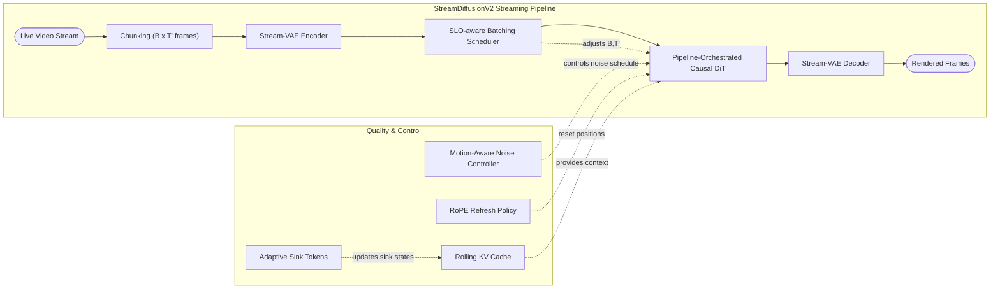
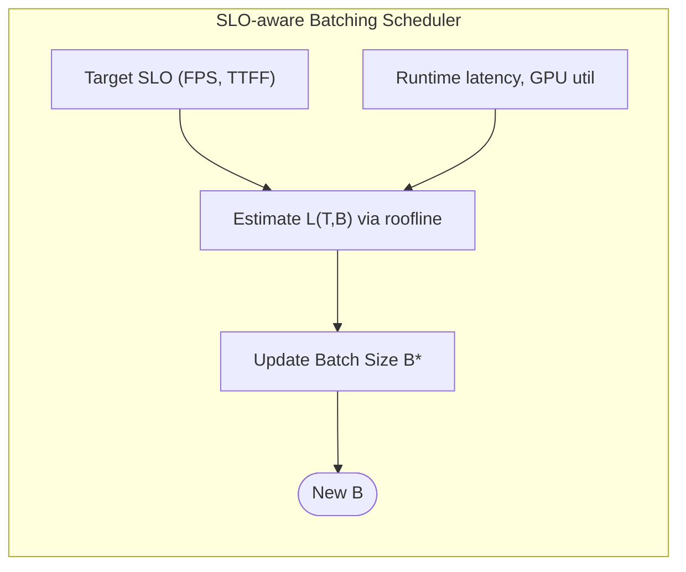
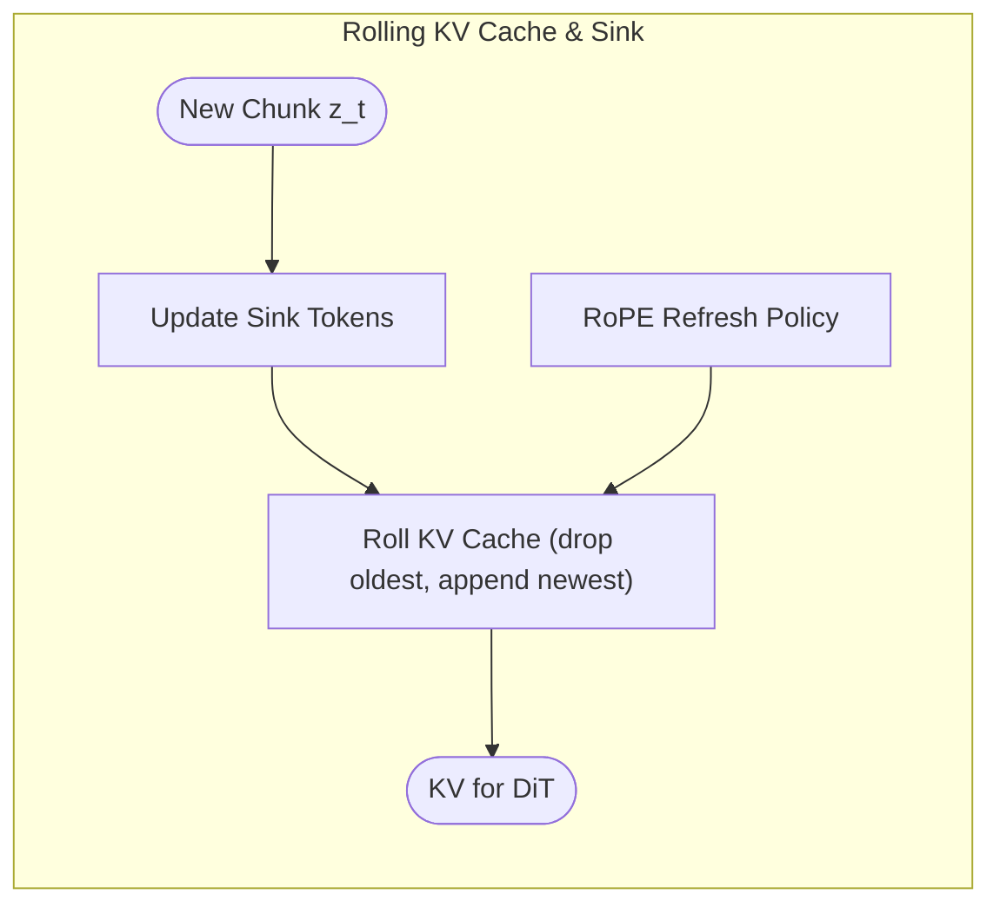
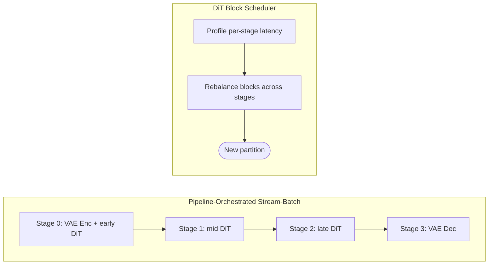

# StreamDiffusionV2: A Streaming System for Dynamic and Interactive Video Generation

## 0. Metadata
- **Full Title**: StreamDiffusionV2: A Streaming System for Dynamic and Interactive Video Generation  
- **Authors**: Tianrui Feng, Zhi Li, Shuo Yang, Haocheng Xi, Muyang Li, Xiuyu Li, Lvmin Zhang, Keting Yang, Kelly Peng, Song Han, Maneesh Agrawala, Kurt Keutzer, Akio Kodaira, Chenfeng Xu  
- **Venue / Year**: 预印本（arXiv/项目页），约 2025 年  
- **Links**: Project Page：https://streamdiffusionv2.github.io/ ｜ Code：https://github.com/chenfengxu714/StreamDiffusionV2 ｜ ArXiv：https://arxiv.org/abs/2511.07399  
- **Keywords**: video diffusion, live streaming, real-time generation, SLO-aware scheduling, pipeline parallelism, motion-aware denoising, sink token, rolling KV cache  
- **Paper ID (short handle)**: streamdiffusionv2  

## 1. TL;DR (3–5 bullets)
- **Problem**: 现有基于图像或离线视频扩散模型的“实时”视频生成系统，要么牺牲实时性（高 TTFF、难满足 per-frame deadline），要么牺牲长时稳定性（漂移、撕裂、风格衰减），尤其在多 GPU 扩展和高动态场景下表现不佳。  
  > “Such large chunks violate real-time service-level objectives (SLOs)… time-to-first-frame must be minimal, and every frame must meet a per-frame deadline with low jitter.” (Abstract; paper-source/tex/paper.tex)  
- **Idea**: 不重新训练模型，而是围绕现有视频扩散模型构建一个训练无关（training-free）的系统层 pipeline：用 SLO-aware batching + 多 GPU pipeline 并行 + KV cache / RoPE 控制 + 动态噪声调度，专门针对“直播场景”的实时性与长时稳定性做系统级改造。  
  > “we present **StreamDiffusionV2**, a *training-free* pipeline for interactive live streaming with video diffusion models.” (Abstract; paper-source/tex/paper.tex)  
- **System**: 设计包含 SLO-aware batching scheduler、DiT block scheduler、stream-batch pipeline orchestration、sink-token–guided rolling KV cache、adaptive RoPE refresh、motion-aware noise controller、Stream-VAE、异步通信重叠等模块的端到端 streaming 系统。  
  > “StreamDiffusionV2 integrates an SLO-aware batching scheduler and a block scheduler, together with a sink-token–guided rolling KV cache, a motion-aware noise controller, and other system-level optimizations.” (Abstract; paper-source/tex/paper.tex)  
- **Efficiency**: 在 4× H100 上，在不使用 TensorRT 或量化的情况下，14B 模型首帧延迟约 0.5s，1.3B 模型达到 64.52 FPS、14B 模型达到 58.28 FPS，并在增加 denoising steps 后仍保持数十 FPS。  
  > “Without TensorRT or quantization, StreamDiffusionV2 renders the first frame within 0.5s and attains 58.28 FPS with a 14B-parameter model and 64.52 FPS with a 1.3B-parameter model on four H100 GPUs.” (Abstract; paper-source/tex/paper.tex)  
- **Result**: 在保证低 TTFF 与 per-frame deadline 的同时，显著提升长时视频的一致性和高动态场景质量，相比 StreamDiffusion / StreamV2V / CausVid 在 CLIP Score 与 Warp Error 上取得更优结果，并展现近线性的多 GPU 扩展能力。  
  > “These results make state-of-the-art generative live streaming practical and accessible—from individual creators to enterprise-scale platforms.” (Abstract; paper-source/tex/paper.tex)  

## 2. Problem & Motivation

### 2.1 直播场景下“实时视频扩散”的核心痛点
- **离线优化 vs 实时 SLO（Service-Level Objective，服务等级目标）冲突**：当前主流视频扩散（如 WAN 及其高效变种）为了离线吞吐，用固定形状 \(1 \times T \times H \times W\) 的大块输入（T 多达 81～数百帧），严重拉高 time-to-first-frame，难以满足直播对 TTFF ≈1s 和 per-frame deadline 的 SLO（服务等级目标）。  
  > “Such large chunks violate real-time service-level objectives (SLOs)… requires minimal time-to-first-frame (TTFF) and strict per-frame deadlines.” (Introduction; paper-source/tex/paper.tex)  
- **长时生成漂移问题**：很多“流式”系统本质上是从离线双向 DiT 改来的短视频生成器，只在 5–10 秒片段内训练稳定，长期连续推理时 Sink token 陈旧、RoPE 位移累积、固定上下文窗口不适应内容变化，导致主题、风格和运动逐渐漂移。  
  > “These models are trained for short clips (5–10 seconds) and maintain coherence only within that range… sink tokens become stale, RoPE accumulates positional drift…” (Motivation; paper-source/tex/paper.tex)  
- **高动态场景运动撕裂**：数据集多为慢动作，推理时为抑制噪声常采用大 chunk + 固定噪声日程，导致快运动时过度平滑、模糊、ghosting 和 tearing；而慢场景又无法充分增强细节。  
  > “…predominantly trained on slow-motion datasets… rule-based noise schedules… over-smooths motion and erodes fine details… suffer from blur, ghosting, and motion tearing.” (Motivation; paper-source/tex/paper.tex)  
- **多 GPU 扩展不适配实时负载**：传统 sequence parallel / naive pipeline parallel 更多针对离线吞吐，在 per-frame deadline 约束下，通信延迟与短序列导致任务进入 memory-bound 区域，扩展效率低，FPS 提升有限。  
  > “…sequence parallelism suffers from unpredictable communication overhead, while naive pipeline parallelism yields minimal improvement in FPS… achieving scalable, low-jitter performance remains an open system challenge.” (Introduction; paper-source/tex/paper.tex)  

### 2.2 StreamDiffusionV2 的问题刻画与设计目标
- **问题刻画**：给定现成的视频扩散模型（如 CausVid / Wan 2.1 T2V），在不重新训练或只做极小量微调的前提下，为直播场景构建一个能够：  
  - 满足严格 SLO（低 TTFF + 每帧 deadline）；  
  - 支持小时级长时生成且保持风格与结构稳定；  
  - 在高运动场景中避免撕裂与模糊；  
  - 在多 GPU、异构 GPU 环境下高效扩展的推理系统。  
  > “Our objective is stringent: to satisfy live-streaming SLOs … while preserving temporal consistency and visual fidelity over long, dynamic sequences, and… scalable solution that serves users at different levels of compute capacity.” (Introduction; paper-source/tex/paper.tex)  
- **论文的总体答案**：通过一个分层的系统设计，将“实时调度与质量控制”和“可扩展 pipeline 编排”解耦处理，再辅以一系列系统级 co-design 机制，使 streaming 推理在实时约束下仍能接近 roofline 膝点、充分利用 GPU。  
  > “our design is based on two key layers of optimization: (1) real-time scheduling and quality control… (2) scalable pipeline orchestration…” (Methodology; paper-source/tex/paper.tex)  

## 3. Key Ideas & Contributions (Condensed)
- **训练无关的 streaming 视频扩散系统**：提出 StreamDiffusionV2，在不修改/再训练 backbone 的前提下，通过调度和系统层改造，将离线视频扩散模型转化为满足直播 SLO 的 streaming 系统。  
  > “a training-free streaming system that achieves both real-time efficiency and long-horizon visual stability.” (Methodology; paper-source/tex/paper.tex)  
- **SLO-aware batching + Stream Batch**：用小 chunk（少帧）+ 自适应流式 batch（B×T'）替代大 chunk，基于 roofline 分析动态调整 batch 以接近 memory→compute 膝点，在满足 per-frame deadline 的同时最大化吞吐。  
  > “We intentionally keep \(T'\) small… while adapting the stream batch size \(B\)… As the system approaches the knee point of the roofline model… the scheduler adaptively converges to an optimal batch size \(B^\ast\).” (Methodology; paper-source/tex/paper.tex)  
- **Rolling KV cache + adaptive sink & RoPE 刷新**：设计滚动 KV cache、持续更新 sink tokens、周期性重置 RoPE offset，使长时生成中的语义锚点和位置信息保持新鲜，从而抑制风格漂移和长期失真。  
  > “…sink-token–guided rolling KV cache… adaptive sink tokens with RoPE refreshing to deliver high-quality user interaction and hours-level streaming stability.” (Abstract & Methodology; paper-source/tex/paper.tex)  
- **Motion-aware noise controller**：根据最近几帧 latent 间的均方差估计运动强度，推导出归一化运动指标 \(\hat d_t\)，再通过 EMA 平滑调节 denoising 噪声率，使快速运动场景更保守、慢节奏场景更细致。  
  > “we propose a motion-aware noise scheduler that adaptively regulates the denoising noise rate according to the estimated motion magnitude of recent frames.” (Methodology; paper-source/tex/paper.tex)  
- **Pipeline-Orchestration + DiT Block Scheduler + Stream-VAE**：将 DiT block 跨 GPU 划分为流水线，结合 Stream Batch 形成 dual-pipeline scheduler；用 DiT block scheduler 动态再平衡各 GPU 工作量，并通过 Stream-VAE 和异步通信重叠进一步提升整体吞吐。  
  > “a scalable pipeline orchestration that parallelizes the diffusion process across denoising steps and network layers… DiT block scheduler, Stream-VAE, and asynchronous communication overlap…” (Abstract & Methodology; paper-source/tex/paper.tex)  

## 4. Method Overview

从系统视角看，StreamDiffusionV2 是一个围绕“既有因果视频 DiT 模型”搭建的 streaming inference pipeline，它将输入直播视频分割为小 chunk，以流式批处理的方式在多 GPU 上进行流水线推理，并在推理过程中持续调整批大小、KV cache、Sink token、RoPE 以及噪声日程，以同时满足实时性与视觉质量。

> “StreamDiffusionV2 synergizes several techniques to achieve both efficiency and visual quality objectives… SLO-aware batching scheduler… dynamic scheduler that orchestrates the pipeline… continuously update the sink tokens… motion-aware noise scheduler…” (Introduction; paper-source/tex/paper.tex)  

### 4.1 实时调度与质量控制层
- **目标**：在严格 SLO（TTFF 与 per-frame latency）下最大化单机吞吐，并在小时级 streaming 过程中保持外观风格和运动结构的稳定。  
  > “real-time scheduling and quality control… to meet per-frame deadlines while maintaining long-horizon temporal coherence and visual fidelity” (Methodology; paper-source/tex/paper.tex)  
- **机制**：  
  - SLO-aware batching：根据目标帧率 \(f_{\mathrm{SLO}}\) 与当前硬件负载自适应调整 batch 大小 B；  
  - Adaptive sink & RoPE refresh：基于内容 / 主题 / 运动 regime 变化，更新 sink token 集合与 RoPE offset；  
  - Motion-aware noise controller：对不同运动强度的 chunk 采用不同噪声率与步长日程。  
  > “StreamDiffusionV2 achieves real-time video generation through three key components: (1) an SLO-aware batching scheduler… (2) an adaptive sink and RoPE refresh mechanism… (3) a motion-aware noise scheduler…” (Methodology; paper-source/tex/paper.tex)  

### 4.2 可扩展 Pipeline Orchestration 层
- **目标**：在多 GPU 环境下，实现在不违背 per-frame deadline 的前提下近线性 FPS 提升，并在 memory-bound 场景下尽量接近 roofline 膝点。  
  > “a scalable pipeline orchestration, which parallelizes the diffusion process across denoising steps and network stages to achieve near-linear FPS scaling without violating latency guarantees.” (Methodology; paper-source/tex/paper.tex)  
- **机制**：  
  - 将 DiT blocks 拆分为跨设备的 pipeline stages，每个 stage 内部使用 Stream Batch 进行批量 denoising；  
  - 配合 DiT block scheduler 动态迁移 blocks，实现 stage 间负载平衡；  
  - 利用双 CUDA stream（compute + communication）实现计算与通信的重叠。  
  > “The DiT blocks are partitioned across devices… operate concurrently in a pipeline-parallel manner… dynamic inference-time DiT block scheduler… two CUDA streams: a computation stream and a communication stream.” (Methodology & Analysis; paper-source/tex/paper.tex)  

### 4.3 总体 Pipeline 结构示意



> “We pair an SLO-aware batching scheduler (controlling input size) with a pipeline orchestration… We deploy a motion-aware noise controller… combine adaptive sink tokens with RoPE refreshing… rolling KV cache…” (Methodology; paper-source/tex/paper.tex)  

## 5. Interface / Contract (Inputs & Outputs)
- **Inputs**：  
  - 实时视频帧流（camera / screen capture 等），逐帧到达；  
  - 文本 / 图像条件（prompt、style reference、虚拟主播形象等）；  
  - 目标服务 SLO（目标 FPS \(f_{\mathrm{SLO}}\)、最大可接受 TTFF、延迟抖动上限等）。  
- **Outputs**：  
  - 与原视频分辨率与帧率匹配或接近的风格化 / 生成视频流；  
  - 在长时直播过程中保持风格一致、运动结构稳定的输出序列。  
- **控制信号**：  
  - SLO-aware scheduler 对 batch 大小 B、chunk 长度 T' 的调节；  
  - motion-aware controller 输出的噪声率 \(s_t\)；  
  - sink token 更新频率与策略、RoPE offset 重置时机。  
  > “Given a target frame rate \(f_{\mathrm{SLO}}\), the system processes \(T\) frames per iteration… The achieved processing frequency… increases with larger batch size \(B\)… We also reset RoPE offsets at chunk boundaries…” (Methodology & Introduction; paper-source/tex/paper.tex)  

- **参考实现（输入视频读取与预处理）**：  

```python
import torchvision
import torchvision.transforms.functional as TF
from einops import rearrange

def load_mp4_as_tensor(
    video_path: str,
    max_frames: int | None = None,
    resize_hw: tuple[int, int] | None = None,
    normalize: bool = True,
) -> torch.Tensor:
    """
    将 mp4 视频读成张量，输出形状为 (C, T, H, W)。
    """
    video, _, _ = torchvision.io.read_video(video_path, output_format="TCHW")  # (T, C, H, W)
    if max_frames is not None:
        video = video[:max_frames]

    video = rearrange(video, "t c h w -> c t h w")                              # -> (C, T, H, W)
    if resize_hw is not None:
        c, t, h0, w0 = video.shape
        video = torch.stack(
            [TF.resize(video[:, i], resize_hw, antialias=True) for i in range(t)],
            dim=1,
        )                                                                       # -> (C, T, H', W')
    video = video.float()
    if normalize:
        video = video / 127.5 - 1.0                                             # 像素归一化到 [-1, 1]
    return video                                                                # (C, T, H, W)
```

> Implementation: (context/refcode/streamdiffusionv2/streamv2v/inference.py:27-63)  

## 6. Architecture / Components

### 6.1 SLO-aware Batching Scheduler
- **描述**：根据目标帧率与 GPU 带宽估算延迟模型 \(L(T,B)\)，在不超过流中已到达帧数的前提下，自适应调整 batch 大小 B，使系统在 roofline 膝点附近运行。  
  > “the inference latency can be approximated as \(L(T,B) \approx \frac{A(T,B)+P_{\mathrm{model}}}{\eta \mathrm{BW}_{\mathrm{HBM}}}\)… achieved processing frequency… \(f = BT / L(T,B) \propto \frac{B}{1+B}\)… scheduler adaptively converges to an optimal batch size \(B^\ast\).” (Methodology; paper-source/tex/paper.tex)  



```python
# 伪代码：批大小自适应调度（基于文中公式与描述）
def update_batch_size(target_f_slo, T, cur_latency, cur_B, gpu_bw, model_params):
    # A(T,B) ~ O(B*T); 近似线性
    A = alpha * cur_B * T                      # alpha: 与 FlashAttention 等实现相关
    L_est = (A + model_params) / (eta * gpu_bw)
    f_est = cur_B * T / L_est                  # 当前估计 FPS
    if f_est < target_f_slo:
        cur_B += 1                             # 提高 B 提升利用率
    else:
        cur_B = max(1, cur_B - 1)              # 降低 B 避免违约
    return cur_B
# X: (B, T, C, H, W)
```

### 6.2 Rolling KV Cache + Adaptive Sink & RoPE Refresh
- **描述**：将注意力 KV cache 设计为 rolling 结构，对 sink token 状态与 RoPE offset 动态更新，避免长时推理中“固定上下文”带来的漂移。  
  > “a sink-token–guided rolling KV cache… continuously update the sink tokens… reset RoPE offsets at chunk boundaries to avoid positional misalignment over long horizons.” (Abstract & Introduction; paper-source/tex/paper.tex)  



```python
# 伪代码：滚动 KV cache 与 sink 刷新
def rolling_kv_update(kv_cache, new_kv, max_len):
    # kv_cache: (L_ctx, Heads, Dim)
    kv_cache = torch.cat([kv_cache, new_kv], dim=0)
    if kv_cache.shape[0] > max_len:
        kv_cache = kv_cache[-max_len:]         # 只保留最近 max_len 上下文
    return kv_cache

def refresh_rope_offset(t, period):
    # 每隔 period 帧重置一次 RoPE offset
    if t % period == 0:
        return 0
    else:
        return t
```

- **参考实现（KV cache 结构与 streaming 更新）**：  

```python
def _initialize_kv_cache(self, batch_size, dtype, device):
    """
    为每个 Transformer block 初始化 KV cache。
    k/v 形状: (B, L_ctx, num_heads, head_dim=128)
    """
    kv_cache1 = []
    for i in range(self.num_transformer_blocks):
        cache_length = self.kv_cache_length
        # 为每层自注意力设置 sink token 数量
        self.generator.model.blocks[i].self_attn.sink_size = self.num_sink_tokens

        kv_cache1.append({
            "k": torch.zeros([batch_size, cache_length, self.num_heads, 128], dtype=dtype, device=device),
            "v": torch.zeros([batch_size, cache_length, self.num_heads, 128], dtype=dtype, device=device),
            "global_end_index": torch.tensor([0], dtype=torch.long, device=device),
            "local_end_index": torch.tensor([0], dtype=torch.long, device=device),
        })
    self.kv_cache1 = kv_cache1   # len = num_transformer_blocks
```

```python
def inference_stream(self, noise: torch.Tensor,
                     current_start: int,
                     current_end: int,
                     current_step: int) -> torch.Tensor:
    # noise: (1, F_block, C_latent, H', W')
    # hidden_states: (num_steps, F_block, C_latent, H', W')
    self.hidden_states[1:] = self.hidden_states[:-1].clone()
    self.hidden_states[0] = noise[0]

    # 滚动 KV 区间，形成“rolling” cache
    self.kv_cache_starts[1:] = self.kv_cache_starts[:-1].clone()
    self.kv_cache_starts[0] = current_start
    self.kv_cache_ends[1:] = self.kv_cache_ends[:-1].clone()
    self.kv_cache_ends[0] = current_end

    if current_step is not None:
        self.timestep[0] = current_step

    # 带 KV cache 的一次 streaming 前向
    self.hidden_states = self.generator(
        noisy_image_or_video=self.hidden_states,
        conditional_dict=self.conditional_dict,
        timestep=self.timestep.unsqueeze(1).expand(-1, self.hidden_states.shape[1]),
        kv_cache=self.kv_cache1,
        crossattn_cache=self.crossattn_cache,
        current_start=self.kv_cache_starts,
        current_end=self.kv_cache_ends,
    )

    # 对不同时间步添加噪声，准备下一次 denoising
    for i in range(len(self.denoising_step_list) - 1):
        self.hidden_states[[i]] = self.scheduler.add_noise(
            self.hidden_states[[i]],
            torch.randn_like(self.hidden_states[[i]]),
            self.denoising_step_list[i + 1] *
            torch.ones([1], device="cuda", dtype=torch.long),
        )
    return self.hidden_states
```

> Implementation: (context/refcode/streamdiffusionv2/causvid/models/wan/causal_stream_inference.py:70-87,217-270)  

### 6.3 Motion-Aware Noise Controller
- **描述**：通过相邻 latent 之间的均方差估计短时间窗内运动强度，并归一化成 \(\hat d_t\)，再经 EMA 平滑映射到噪声率 \(s_t\)，从而对快/慢运动采用不同的 denoising 强度。  
  > “we estimate the motion magnitude between consecutive frames using a frame-difference metric… normalized… \(\hat d_t = \mathrm{clip}(\frac{1}{\sigma}\max d_i,0,1)\)… finally, we smooth the noise rate \(s_t\) using an exponential moving average (EMA).” (Methodology; paper-source/tex/paper.tex)  

```python
# Inputs: v_t, v_{t-1}: (C,H,W); 运动强度估计与噪声率更新
def motion_intensity(v_t, v_prev):
    diff = (v_t - v_prev) ** 2                 # (C,H,W)
    return torch.sqrt(diff.mean())            # 标量 d_t

def update_noise_rate(d_hist, sigma, s_prev, s_min, s_max, lam):
    # d_hist: 最近 k 帧的 d_t
    d_hat = max(d_hist) / sigma
    d_hat = d_hat.clamp(0.0, 1.0)
    s_target = s_max - (s_max - s_min) * d_hat
    s_t = lam * s_target + (1 - lam) * s_prev
    return s_t
# v_t: (C,H,W)
```

- **参考实现（按视频内容自适应调整 noise scale）**：  

```python
def compute_noise_scale_and_step(
    input_video_original: torch.Tensor,  # (B, C, T, H, W)
    end_idx: int,
    chunck_size: int,
    noise_scale: float,
):
    """
    基于最近一个 chunk 的帧间差异，动态调整噪声尺度和当前 step。
    """
    # 相邻帧 L2 差异: (B, C, chunk, H, W)
    l2_dist = (
        input_video_original[:, :, end_idx - chunck_size:end_idx]
        - input_video_original[:, :, end_idx - chunck_size - 1:end_idx - 1]
    ) ** 2
    # 在 batch / 通道 / 空间维上平均，再对时间取最大 -> 标量
    l2_dist = (torch.sqrt(l2_dist.mean(dim=(0, 1, 3, 4))).max() / 0.2).clamp(0, 1)

    new_noise_scale = (0.9 - 0.2 * l2_dist.item()) * 0.9 + noise_scale * 0.1
    current_step = int(1000 * new_noise_scale) - 100
    return new_noise_scale, current_step
# input_video_original: (B, C, T, H, W)
```

> Implementation: (context/refcode/streamdiffusionv2/streamv2v/inference.py:66-72)  

### 6.4 Pipeline-Orchestrated Stream Batch & DiT Block Scheduler
- **描述**：将 DiT blocks 沿深度划分成多个 stage，在多 GPU 上构成流水线，每个 stage 内部使用 stream-batch；再通过轻量的 block scheduler 动态迁移 blocks，使各 stage 执行时间尽量均衡，减少 pipeline 泡泡。  
  > “The DiT blocks are distributed across multiple devices for pipeline parallelism, while the Stream-Batch strategy is applied within each stage… We introduce a lightweight inference-time DiT block scheduler that dynamically reallocates blocks between devices based on measured execution time.” (Methodology & Analysis; paper-source/tex/paper.tex)  



```python
# 伪代码：基于测量的 block-level 延迟进行再分配
def rebalance_blocks(latencies, partitions):
    # latencies: 每个 block 当前耗时列表
    # partitions: 每个 stage 包含哪些 blocks
    # 简化：将耗时最长的 block 从最慢 stage 移到最快 stage
    slow_stage = argmax_stage_latency(latencies, partitions)
    fast_stage = argmin_stage_latency(latencies, partitions)
    block_to_move = pick_heaviest_block(partitions[slow_stage], latencies)
    partitions[slow_stage].remove(block_to_move)
    partitions[fast_stage].append(block_to_move)
    return partitions
```

- **参考实现（多 GPU 下的 buffer / KV cache 管理）**：  

```python
class BufferManager:
    """
    管理 GPU buffer 池，避免频繁分配/释放。
    """
    def __init__(self, device: torch.device, config: CommunicationConfig | None = None):
        self.device = device
        self.config = config or CommunicationConfig()
        # 不同类型 buffer 池: latent / origin / kv / misc
        self.free_buffers: dict[tuple[int, ...], list[torch.Tensor]] = {}
        self.free_buffers_kv: dict[tuple[int, ...], list[torch.Tensor]] = {}
        ...

    def get_buffer(self, shape: tuple[int, ...], dtype: torch.dtype,
                   buffer_type: str = "latent") -> torch.Tensor:
        """
        从池中复用或新建指定形状的张量。
        """
        with self._lock:
            if buffer_type == "kv":
                buffer_pool = self.free_buffers_kv
            ...
            if self.config.enable_buffer_reuse and shape in buffer_pool and buffer_pool[shape]:
                return buffer_pool[shape].pop()                        # 复用
            return torch.empty(shape, dtype=dtype, device=self.device) # 新分配
```

```python
class KVCacheManager:
    """
    在多机并行推理中管理 KV cache 的所有权与广播。
    """
    def broadcast_kv_blocks(self, block_indices: list[int], donor_rank: int) -> None:
        # 对每个 block i，将 kv_cache1[i] 从 donor_rank 广播到所有 rank
        for bi in block_indices:
            if self.pipeline.kv_cache1[bi]["k"].device != self.device:
                self.pipeline.kv_cache1[bi]["k"] = self.pipeline.kv_cache1[bi]["k"].to(self.device)
                self.pipeline.kv_cache1[bi]["v"] = self.pipeline.kv_cache1[bi]["v"].to(self.device)

            dist.barrier()
            dist.broadcast(self.pipeline.kv_cache1[bi]["k"], src=donor_rank)       # (B, L_ctx, H, D)
            dist.broadcast(self.pipeline.kv_cache1[bi]["v"], src=donor_rank)
            dist.broadcast(self.pipeline.kv_cache1[bi]["global_end_index"], src=donor_rank)
            dist.broadcast(self.pipeline.kv_cache1[bi]["local_end_index"], src=donor_rank)
```

> Implementation: (context/refcode/streamdiffusionv2/streamv2v/communication/buffer_manager.py:61-100, context/refcode/streamdiffusionv2/streamv2v/communication/kv_cache_manager.py:48-82)  

### 6.5 Stream-VAE 与异步通信重叠
- **描述**：Stream-VAE 以小 chunk（如 4 帧）在线编码，并在 3D 卷积中缓存中间特征保持时间一致性；通信方面每个 GPU 维护计算与通信两条 CUDA stream，实现 activation 传输与本地计算的重叠。  
  > “StreamDiffusionV2 integrates a low-latency Video-VAE variant designed for streaming inference… caches intermediate features… each GPU maintains two CUDA streams: a computation stream and a communication stream… overlapping kernels with P2P transfers.” (Methodology & Figure illustration; paper-source/tex/paper.tex)  

- **参考实现（WanVAE 的 streaming 编码/解码）**：  

```python
class WanVAEWrapper(VAEInterface):
    def __init__(self):
        ...
        self.model = _video_vae(..., z_dim=16).eval().requires_grad_(False)

    def stream_decode_to_pixel(self, latent: torch.Tensor) -> torch.Tensor:
        # latent: (B, F, C_latent=16, H', W')
        zs = latent.permute(0, 2, 1, 3, 4)                  # -> (B, C_latent, F, H', W')
        zs = zs.to(torch.bfloat16).to("cuda")
        device, dtype = latent.device, latent.dtype
        scale = [self.mean.to(device=device, dtype=dtype),
                 1.0 / self.std.to(device=device, dtype=dtype)]
        out = self.model.stream_decode(zs, scale).float().clamp_(-1, 1)
        out = out.permute(0, 2, 1, 3, 4)                    # -> (B, F, 3, H, W)
        return out
```

```python
class WanVAE_(nn.Module):
    ...
    def stream_encode(self, x: torch.Tensor) -> torch.Tensor:
        # x: (B, C_in=3, T, H, W)
        t = x.shape[2]
        if self.first_encode:
            self.first_encode = False
            self.clear_cache_encode()
            self._enc_conv_idx = [0]
            out = self.encoder(
                x[:, :, :1, :, :],                 # 先编码首帧
                feat_cache=self._enc_feat_map,
                feat_idx=self._enc_conv_idx,
            )
            self._enc_conv_idx = [0]
            out_ = self.encoder(
                x[:, :, 1:, :, :],                 # 再编码剩余帧
                feat_cache=self._enc_feat_map,
                feat_idx=self._enc_conv_idx,
            )
            out = torch.cat([out, out_], dim=2)
        else:
            # 后续 chunk 按 4 帧一组编码
            outs = []
            for i in range(t // 4):
                self._enc_conv_idx = [0]
                outs.append(
                    self.encoder(
                        x[:, :, i * 4:(i + 1) * 4, :, :],
                        feat_cache=self._enc_feat_map,
                        feat_idx=self._enc_conv_idx,
                    )
                )
            out = torch.cat(outs, dim=2)          # (B, 2*z_dim, T', H', W')
        mu, log_var = self.conv1(out).chunk(2, dim=1)
        return mu                                  # 作为 latent: (B, z_dim, T', H', W')
```

> Implementation: (context/refcode/streamdiffusionv2/causvid/models/wan/wan_wrapper.py:59-77,114-122; context/refcode/streamdiffusionv2/causvid/models/wan/wan_base/modules/vae.py:546-577,605-642)  

## 7. Algorithm / Pseudocode (Streaming Inference Loop)

下面给出一个高度概括的 streaming 推理主循环伪代码，展示上述组件如何协同工作（基于论文描述抽象而来）：

```python
def streamdiffusionv2_loop(frames, prompt, target_f_slo):
    """
    frames: 输入实时视频帧流迭代器
    prompt: 文本/图像条件
    """
    B = 1                      # 初始 batch 大小
    T = T_prime                # 每 chunk 帧数，较小
    kv_cache = init_kv_cache()
    sink_state = init_sink(prompt)
    rope_offset = 0
    s_prev = s_max             # 初始噪声率
    d_hist = []

    while True:
        chunk = collect_frames(frames, B, T)      # (B,T,H,W)
        if not chunk:
            break

        # 1) SLO-aware 更新 batch
        B = update_batch_size(target_f_slo, T, cur_latency(), B,
                              gpu_bw, model_params)

        # 2) Stream-VAE 编码
        z = stream_vae_encode(chunk)             # (B,T,C,H',W')

        # 3) 运动估计 + 噪声率控制
        d_t = motion_intensity(z[:, -1], z[:, -2])
        d_hist.append(d_t)
        if len(d_hist) > k:
            d_hist.pop(0)
        s_t = update_noise_rate(d_hist, sigma, s_prev,
                                s_min, s_max, lam)
        s_prev = s_t

        # 4) Sink / RoPE / KV 更新
        sink_state = update_sink_state(sink_state, z, prompt)
        rope_offset = refresh_rope_offset(global_t(), period)
        kv_cache = rolling_kv_update(kv_cache, extract_kv(z, sink_state),
                                     max_ctx_len)

        # 5) Pipeline DiT 推理（多 GPU）
        z_denoised = pipeline_dit_forward(z, kv_cache, s_t,
                                          rope_offset, partitions)

        # 6) Stream-VAE 解码
        out_frames = stream_vae_decode(z_denoised)
        yield out_frames
```

> “These mechanisms collectively enable our pipeline to achieve truly infinite-length video-to-video live-streaming generation while maintaining stable quality and consistent style.” (Project Page; external)  

- **参考实现（单机 streaming 推理主循环）**：  

```python
def run_inference(
    self,
    input_video_original: torch.Tensor,  # (B=1, C=3, T, H, W)
    prompts: list[str],
    num_chuncks: int,
    chunck_size: int,
    noise_scale: float,
    output_folder: str,
    fps: int,
    num_steps: int,
):
    start_idx, end_idx = 0, 5                       # 首个 chunk 的帧区间
    current_start = 0
    current_end = self.pipeline.frame_seq_length * 2

    # --- 首个 chunk: 编码 + 预热 ---
    if input_video_original is not None:
        inp = input_video_original[:, :, start_idx:end_idx]          # (1,3,5,H,W)
        noise_scale, current_step = compute_noise_scale_and_step(
            input_video_original, end_idx, chunck_size, noise_scale
        )
        latents = self.pipeline.vae.model.stream_encode(inp)         # (1,16,T',H',W')
        latents = latents.transpose(2, 1).contiguous().to(dtype=torch.bfloat16)  # (1,T',16,H',W')

        noise = torch.randn_like(latents)
        noisy_latents = noise * noise_scale + latents * (1 - noise_scale)
    else:
        noisy_latents = torch.randn(
            1, 1 + self.pipeline.num_frame_per_block, 16,
            self.pipeline.height, self.pipeline.width,
            device=self.device, dtype=torch.bfloat16,
        )

    # 使用 prepare() 完成第一次 denoising，并初始化 KV cache
    denoised_pred = self.prepare_pipeline(
        text_prompts=prompts,
        noise=noisy_latents,
        current_start=current_start,
        current_end=current_end,
    )
    video = self.pipeline.vae.stream_decode_to_pixel(denoised_pred)   # (1,F,3,H,W)

    # --- 后续 chunks: 循环 streaming 推理 ---
    while self.processed < num_chuncks + num_steps - 1:
        start_idx, end_idx = end_idx, end_idx + chunck_size
        current_start = current_end
        current_end = current_end + (chunck_size // 4) * self.pipeline.frame_seq_length

        if input_video_original is not None and end_idx <= input_video_original.shape[2]:
            inp = input_video_original[:, :, start_idx:end_idx]      # (1,3,chunk,H,W)
            noise_scale, current_step = compute_noise_scale_and_step(
                input_video_original, end_idx, chunck_size, noise_scale
            )
            latents = self.pipeline.vae.model.stream_encode(inp)     # (1,16,T',H',W')
            latents = latents.transpose(2, 1).contiguous().to(dtype=torch.bfloat16)
            noise = torch.randn_like(latents)
            noisy_latents = noise * noise_scale + latents * (1 - noise_scale)
        else:
            noisy_latents = torch.randn(
                1, self.pipeline.num_frame_per_block, 16,
                self.pipeline.height, self.pipeline.width,
                device=self.device, dtype=torch.bfloat16,
            )
            current_step = None

        # streaming DiT 推理: 内部使用 rolling KV cache
        denoised_pred = self.pipeline.inference_stream(
            noise=noisy_latents,
            current_start=current_start,
            current_end=current_end,
            current_step=current_step,
        )

        # 再通过 Stream-VAE 解码出像素帧
        if self.processed >= num_steps:
            video = self.pipeline.vae.stream_decode_to_pixel(denoised_pred[[-1]])  # (1,F,3,H,W)
            ...
```

> Implementation: (context/refcode/streamdiffusionv2/streamv2v/inference.py:160-240,251-268)  

## 8. Training Setup
- **基础模型**：基于 Wan 2.1 与 CausVid 的因果视频扩散模型构建 streaming pipeline，本身方法部分是“training-free”；附录中讨论了用 REPA 在 distillation 期间进一步提升视觉质量的可选训练方案。  
  > “The StreamDiffusionV2 model is built on Wan 2.1 and CausVid… The proposed method is training-free.” (Experiments; paper-source/tex/paper.tex)  
- **可选 REPA 微调**：在附录中，作者采用 REPA 对 Causal DiT distillation 进行增益训练，引入 DINOv2 监督，与 DMD distillation loss 组合。  
  > “we employ the REPA training strategy during Causal-DiT distillation… The alignment loss is denoted by… When combined with the original DMD distillation objective, the overall training objective is defined as \(\mathcal{L} = \mathcal{L}_{\mathrm{DMD}} + \lambda \mathcal{L}_{\mathrm{REPA}}\).” (Appendix; paper-source/tex/paper.tex)  
- **数据集与指标**：使用直播场景数据（包括高速度运动场景）进行评估；质量指标包括 CLIP Score、warp error，效率指标包括 FPS 与 TTFF，以及加速比。  
  > “We benchmark throughput under varying methods and configurations… We report FPS and time-to-First-Frame (TTFF)… We report the CLIP consistency and warp error to indicate the consistency of generated videos.” (Experiments; paper-source/tex/paper.tex)  

## 9. Inference / Runtime Behavior
- **输入需求**：连续视频帧流、prompt / reference image、目标帧率与分辨率、多 GPU 拓扑信息。  
- **控制参数**：  
  - denoising steps（1–4）决定质量与延迟；  
  - Stream Batch 大小 B 由 scheduler 动态调整；  
  - motion-aware controller 的窗口长度 k、噪声上下界 \(s_{\min}, s_{\max}\) 与 EMA 系数 \(\lambda\)。  
- **运行时特性**：  
  - 首帧延迟极低（0.47–0.5s 级），适合交互式应用；  
  - 在不同分辨率、步数与 GPU 类型（H100 / 4090）下保持稳定 FPS；  
  - pipeline & communication 设计使系统即便在 14B 模型下仍接近带宽 roofline。  
  > “StreamDiffusionV2 achieves 42.26 FPS at 480P and 61.57 FPS at 512×512 (1-step)… The pipeline-parallel Stream-batch design achieves 39.24 FPS at 480P and 58.28 FPS at 512×512 across 4 GPUs for the 14B model.” (Experiments; paper-source/tex/paper.tex)  

## 10. Experiments & Results

- **Benchmarks & datasets**：直播风格视频数据，涵盖慢动作与高动态场景，用于评估 temporal consistency、style preservation 与高运动稳定性。  
- **Metrics**：  
  - CLIP Score（语义一致性）；  
  - Warp Error（像素级时间一致性）；  
  - FPS、TTFF（效率与延迟）；  
  - acceleration rate = baseline time / optimized time。  
  > “We report the CLIP consistency and prompt score, and warp error… We report FPS and time-to-First-Frame (TTFF)… We also report the acceleration rate…” (Experiments; paper-source/tex/paper.tex)  
- **Baselines**：  
  - StreamDiffusion（图像扩散 streaming）；  
  - StreamV2V（基于图像扩散的视频迁移）；  
  - CausVid（基于 WAN 的因果视频扩散）。  
  > “approaches based on image diffusion models, such as StreamDiffusion and StreamV2V… For CausVid, we implement a naive video-to-video generation baseline…” (Experiments; paper-source/tex/paper.tex)  
- **Headline results（质量）**：  
  - CLIP Score: StreamDiffusionV2 98.51，优于 CausVid 98.48、StreamV2V 96.58、StreamDiffusion 95.24；  
  - Warp Error: StreamDiffusionV2 73.31，显著优于 StreamDiffusion 117.01、StreamV2V 102.99 和 CausVid 78.71。  
  > “CLIP Score… 95.24 / 96.58 / 98.48 / **98.51**… Warp Error… 117.01 / 102.99 / 78.71 / **73.31**.” (Table 3; paper-source/tex/paper.tex)  
- **Headline results（效率）**：  
  - 1.3B 模型在 4×H100 上：480P 42.26 FPS、512×512 61.57 FPS（1-step）；4-step 时仍保持 >40 FPS 与 >60 FPS；  
  - 14B 模型在 4×H100 上：480P 39.24 FPS、512×512 58.28 FPS；  
  - TTFF：在 30 FPS 下，CausVid 与 Wan2.1 T2V 分别比 StreamDiffusionV2 高 18× 和 280×。  
  > “StreamDiffusionV2 achieves 42.26 FPS at 480P and 61.57 FPS at 512×512… the 14B configuration achieves 39.24 FPS at 480P and 58.28 FPS at 512×512… CausVid and Wan2.1-1.3B exhibit 18× and 280× higher TTFF than our pipeline, respectively.” (Experiments; paper-source/tex/paper.tex)  
- **Ablation insights**：  
  - 动态噪声 + Sink Token 均显著降低 Warp Error，其中同时启用时 CLIP Score=98.51、Warp Error=73.13 最优；  
  - 动态 DiT block scheduler 明显缩小 stage 间耗时差异，提升多 GPU 利用率；  
  - Stream Batch 在 dual-pipeline scheduler 中，随着 denoising steps 增加带来更大的 throughput 提升。  
  > “augmenting the baseline with the Motion-Aware Noise Controller… improves Warp Error… When combined with the Sink Token, the pipeline achieves state-of-the-art performance… Stream Batch substantially improves throughput, especially as the number of denoising steps increases.” (Experiments & Analysis; paper-source/tex/paper.tex)  

## 11. Ablations & Analysis
- **Sink Token & Motion-Aware Noise Controller**：  
  - 仅加动态噪声：CLIP Score 略降但 Warp Error 明显改善；  
  - 仅加 Sink Token：风格保持增强，Warp Error 下降；  
  - 两者同时：在 CLIP 与 Warp Error 上都达到最优。  
  > “augmenting the baseline… with the Motion-Aware Noise Controller slightly reduces CLIP Score but noticeably improves Warp Error… When combined with the Sink Token… achieves state-of-the-art performance on both metrics.” (Analysis; paper-source/tex/paper.tex)  
- **DiT Block Scheduler**：  
  - 分析 VAE vs DiT 计算占比，发现 VAE 贡献显著，容易导致 stage 不平衡；  
  - 动态 block scheduler 通过迁移 blocks 平衡 per-device time，减少 pipeline 泡泡，显著提高整体 throughput。  
  > “Video VAE… contributes substantially to the runtime and can induce stage imbalance… Our dynamic scheduler partitions DiT blocks to equalize per-device time, markedly reducing imbalance and improving throughput.” (Analysis; paper-source/tex/paper.tex)  
- **Sequence Parallelism vs Pipeline Orchestration**：  
  - 在 communication cost 上，DeepSpeed-Ulysses、Ring-Attention 的跨设备延迟是本文方案的 20–40×；  
  - 理论 latency（去除通信）分析显示：pipeline parallel 在中低分辨率下仍能保持 near-ideal acceleration，而 sequence parallel 则转为 memory-bound、收益有限。  
  > “both DeepSpeed-Ulysses and Ring-Attention incur ~40–120 ms cross-device latency—about 20–40× higher than our approach… pipeline parallelism attains a near-ideal acceleration… sequence parallelism shows clear gains only at high resolutions…” (Analysis; paper-source/tex/paper.tex)  

## 12. Limitations, Risks, Ethics
- **对硬件依赖较强**：很多实验结果基于 4×H100 + NVLink，虽然也在 4090 + PCIe 上有实验，但在更普通 GPU 或 CPU-only 环境下是否仍能保持足够低的 TTFF 与 FPS，需要进一步验证。  
- **仍依赖大规模基础模型**：系统虽 training-free，但背后的 Wan / CausVid 等模型规模巨大，对显存和推理成本仍有较高要求。  
- **数据与偏见**：论文未详细讨论训练数据的分布、偏见与安全风险；在作为直播工具时，可能继承原始视频数据与文生视频模型的偏见与伦理问题。  
- **复杂性与可维护性**：系统包含多种调度器与缓存策略，工程复杂度较高，在实际部署中需要良好的监控与 fallback 策略，避免在极端网络/负载条件下出现不可预期行为。  

## 13. Applicability & Integration Notes (Project-Focused)
- **在现有直播/实时应用中的位置**：  
  - 可作为“视频风格化 / 虚拟主播”后端，将真实视频流转为风格化生成视频；  
  - 替换或增强当前基于图像扩散的 streaming backend，以解决 temporal consistency 与高动态场景问题。  
- **最小可行集成方案**：  
  - 复用现有 CausVid / Wan 模型权重；  
  - 在现有 inference service 外侧加入 SLO-aware scheduler 与 streaming pipeline；  
  - 把现有的 batch/offline 推理接口包装为小 chunk streaming 接口即可。  
- **依赖与阻碍**：  
  - 需要多 GPU 与高速互联（NVLink 最佳，PCIe 次之）；  
  - 对运维要求较高，需要监控 GPU 利用率、通信瓶颈、延迟抖动等指标。  

## 14. Reproducibility Plan
- **数据与代码可用性**：  
  - 官方项目页与 GitHub 仓库公开推理代码与 demo pipeline；  
  - 模型权重依赖 Wan / CausVid 等第三方发布。  
- **复现步骤（高层）**：  
  - 准备 4×H100（或等效）GPU 环境；  
  - 下载 Wan 2.1 T2V / CausVid 权重；  
  - 部署 StreamDiffusionV2 pipeline，包括 SLO-aware scheduler、pipeline orchestration、Stream-VAE 等组件；  
  - 使用论文中给定的配置（分辨率、step 数）测量 TTFF / FPS / CLIP / Warp Error。  
- **潜在差异来源**：  
  - 不同 GPU / interconnect 的带宽与 latency 差异；  
  - 实际部署环境中的 IO / 编解码开销；  
  - 随机性与实现细节（如不同 FlashAttention 实现）。  

## 15. Related Work
- **基于图像扩散的 streaming（StreamDiffusion / StreamV2V）**：  
  - 优点是集成简单、风格控制灵活，但时间一致性差，高动态场景容易撕裂；  
  - 本文在实验中显示，这类方法的 Warp Error 明显高于基于视频扩散的 StreamDiffusionV2。  
  > “StreamDiffusion and StreamV2V… exhibit noticeable temporal inconsistency, resulting in lower CLIP scores and higher Warp Errors.” (Experiments; paper-source/tex/paper.tex)  
- **视频扩散与 CausVid 系列**：  
  - 通过因果 DiT、多步 distillation 等提升时间一致性与推理效率；  
  - 但主要针对离线 clip 生成，仍采用固定大 chunk，难以满足 streaming SLO。  
  > “CausVid and Self-Forcing are derived from Wan-2.1-T2V… trained for short clips (5–10 seconds)… assumptions break down in continuous live streams…” (Motivation; paper-source/tex/paper.tex)  
- **并行化与通信优化（DeepSpeed-Ulysses, Ring-Attention 等）**：  
  - 这些工作主要从 sequence parallel 角度提升 transformer 吞吐；  
  - 本文提出的 pipeline orchestration 从“实时 streaming + memory-bound roofline”视角出发，展示了在这类场景下 sequence parallel 的局限。  

## 16. Open Questions & Follow-Ups
- **更低资源场景的表现**：在单 4090、单 A10 或云上租赁的中端 GPU 上，是否能通过算法/系统进一步优化以维持可接受的 TTFF 与 FPS？  
- **与模型结构协同设计**：如果允许对 backbone 做有限结构修改，是否能进一步简化 KV cache / sink / RoPE 控制逻辑，使系统更简单、更鲁棒？  
- **质量—延迟可控性**：能否设计更显式的“质量—延迟”控制接口，让上层应用根据交互场景动态选择质量/延迟权衡曲线？  
- **更丰富的输入模态**：例如加入音频、文本交互等多模态信号，使 streaming 系统更加“互动式”，对系统层设计是否会带来新的挑战？  

## 17. Glossary / Notation
- **TTFF (Time-To-First-Frame)**: 首帧生成延迟，是直播体验的关键指标。  
- **SLO (Service-Level Objective，服务等级目标)**: 服务等级目标，包括最低帧率、最大 TTFF、每帧 deadline 等。  
- **Stream Batch (B)**: 直播场景下同时处理的流数量，作为 batch 维度用于提高 GPU 利用率。  
- **Chunk Length (T')**: 每次前向传递处理的帧数，StreamDiffusionV2 中通常取较小值（如 4 帧），以约束单次延迟。  
- **Sink Token**: 代表全局风格/语义锚点的特殊 token，用于在长时生成中保持风格一致。  
- **RoPE (Rotary Position Embedding)**: 旋转式位置编码，StreamDiffusionV2 中通过周期性刷新 offset 减少长时位置漂移。  
- **Rolling KV Cache**: 只保留最近一段上下文的 KV 缓存结构，通过“滚动”更新适配无限长 streaming 推理。  
- **Warp Error**: 衡量视频帧间像素级对齐程度的指标，越低表示时间一致性越好。  

## 18. Figures & Diagrams (Optional)
- [Placeholder] Overview figure path: `figures/pipeline.png`（可参考论文 Figure 2 重新绘制）  
  > “The overview pipeline of our StreamDiffusionV2.” (Methodology; paper-source/tex/paper.tex)  
- [Placeholder] Architecture diagram path: `figures/parallel.png`（对应 pipeline-parallel Stream-Batch 架构）  
  > “The detailed design of our Pipeline-parallel Stream-Batch architecture.” (Methodology; paper-source/tex/paper.tex)  
- [Placeholder] Activity/flow diagram path: `figures/timeline.png`（对应执行时间线与 compute/communication overlap）  
  > “Execution timeline of the Pipeline-orchestration architecture.” (Appendix; paper-source/tex/paper.tex)  

## 19. BibTeX / Citation
```bibtex
@article{streamdiffusionv2,
  title   = {StreamDiffusionV2: A Streaming System for Dynamic and Interactive Video Generation},
  author  = {Feng, Tianrui and Li, Zhi and Yang, Shuo and Xi, Haocheng and Li, Muyang and Li, Xiuyu and Zhang, Lvmin and Yang, Keting and Peng, Kelly and Han, Song and Agrawala, Maneesh and Keutzer, Kurt and Kodaira, Akio and Xu, Chenfeng},
  year    = {2025},
  journal = {arXiv preprint},
  url     = {https://streamdiffusionv2.github.io/}
}
```
