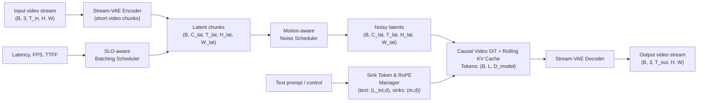
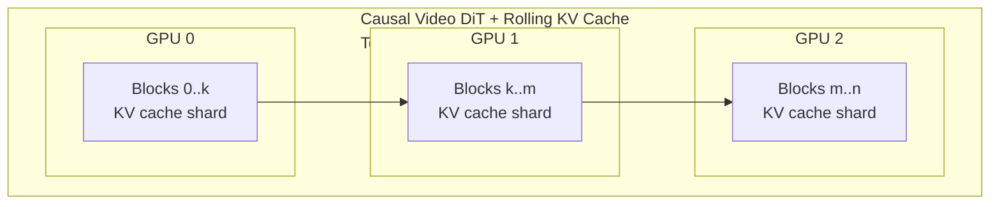
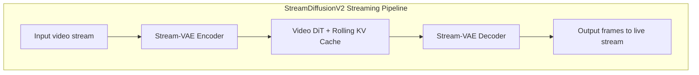
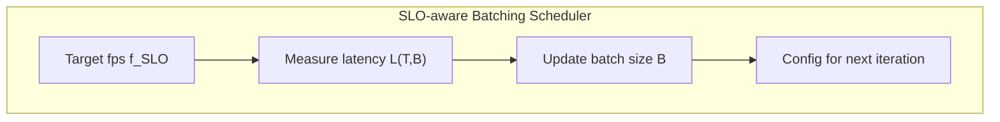

# StreamDiffusionV2: A Streaming System for Dynamic and Interactive Video Generation

## 0. Metadata
- **Full Title**: StreamDiffusionV2: A Streaming System for Dynamic and Interactive Video Generation
- **Authors**: Tianrui Feng, Zhi Li, Shuo Yang, Haocheng Xi, Muyang Li, Xiuyu Li, Lvmin Zhang, Keting Yang, Kelly Peng, Song Han, Maneesh Agrawala, Kurt Keutzer, Akio Kodaira, Chenfeng Xu
- **Venue / Year**: 未明确标注（论文稿，面向实时视频生成场景）
- **Links**: 
  - PDF / LaTeX 源：`paper-source/tex/paper.tex`
  - Project Page: <https://streamdiffusionv2.github.io/>
  - Code（仓库说明中提到的示例实现）: <https://github.com/chenfengxu714/StreamDiffusionV2>
- **Keywords**: streaming video generation, diffusion models, service-level objectives (SLOs), time-to-first-frame (TTFF), pipeline parallelism, motion-aware noise, sink tokens, RoPE
- **Paper ID (short handle)**: streamdiffusionv2

---

## 1. TL;DR (3–5 bullets)
- **Problem**: 现有基于图像的直播生成管线在长时视频上时间一致性差，难以满足直播场景的实时 SLO（TTFF 和逐帧 deadline），同时现有视频扩散模型主要为离线高吞吐优化，不适合在线流式生成。
  > "However, their image-centric design exposes a fundamental weakness: poor temporal consistency. Frame-by-frame generation introduces flicker and drift, causing noticeable instability across time." (Introduction; paper-source/tex/paper.tex)
- **Idea**: 在不重新训练视频扩散模型的前提下，通过 SLO 感知的输入/批量调度、sink-token 引导的滚动 KV cache、RoPE 刷新和 motion-aware 噪声控制，将离线 Video DiT 转化为满足直播 SLO 的流式系统。
  > "We introduce **StreamDiffusionV2**, a training-free streaming system that adapts video diffusion models for interactive, low-latency generation." (Introduction; paper-source/tex/paper.tex)
- **System**: 提出三大核心组件：SLO-aware batching scheduler、adaptive sink & RoPE refresh、motion-aware noise scheduler，并在多 GPU 上设计 Pipeline-parallel Stream-Batch 架构与 DiT Block Scheduler、Stream-VAE 和异步通信重叠实现近线性扩展。
  > "StreamDiffusionV2 achieves real-time video generation through three key components: (1) an SLO-aware batching scheduler... (2) an adaptive sink and RoPE refresh mechanism... and (3) a motion-aware noise scheduler..." (Methodology; paper-source/tex/paper.tex)
- **Efficiency**: 在 4×H100 上，1.3B 模型达到 61.57 FPS（512², 1 步），14B 模型达到 58.28 FPS，同时将 TTFF 降到 0.37–0.47 秒级，且在增加去噪步数后仍维持 30–60 FPS。
  > "StreamDiffusionV2 achieves a substantial reduction in TTFF, reaching 0.47s and 0.37s at 16 FPS and 30 FPS video throughput, respectively." (Experiments – TTFF Results; paper-source/tex/paper.tex)  
  > "... achieves 39.24 FPS at 480P and 58.28 FPS at 512×512 across 4 GPUs..." (Experiments – FPS Results; paper-source/tex/paper.tex)
- **Result**: 相比 CausVid/StreamDiffusion/StreamV2V，在 CLIP Score、Warp Error 以及主观视频稳定性上均有提升，并在高运动场景中显著减轻 tearing / ghosting，同时满足严格直播延迟约束。
  > "These results indicate that our style-preserving and motion-aware strategies effectively enhance pixel-level temporal consistency, while maintaining comparable semantic similarity..." (Generation Quality Evaluation; paper-source/tex/paper.tex)

---

## 2. Problem & Motivation

### 2.1 直播视频生成的核心瓶颈
- **离线优化 vs 实时 SLO 冲突**：现有视频扩散（如 WAN 2.1 及其高效变体）以大 chunk（例如 1×T×H×W, T≈81–数百帧）为输入，追求离线吞吐，导致 TTFF 高、每帧延迟超标，难以满足直播场景「首帧延迟≈1s、逐帧 deadline」的 SLO 要求。
  > "Such large chunks violate real-time service-level objectives (SLOs)... which requires minimal time-to-first-frame (TTFF) and strict per-frame deadlines..." (Introduction; paper-source/tex/paper.tex)
- **固定输入规模导致 TTFF 巨大**：采用固定 81 帧 chunk 的 CausVid/Self-Forcing，在 H100 上 480p 视频的理论 TTFF 可达 5.31 秒，显著超过常见直播标准。
  > "On a single H100 GPU, generating a 480p video with an 81-frame chunk using a 1.3B-parameter model yields a theoretical TTFF of 5.31s..." (Motivation & Bottleneck Analysis; paper-source/tex/paper.tex)
- **长时段 drift 与风格/语义漂移**：现有“流式”视频系统多由离线 clip 生成模型改造，KV cache、sink token、RoPE 等配置针对有限时长设计，在小时级直播中会累积错位与统计漂移，导致运动不稳定、风格渐变。
  > "Beyond this horizon, quality degrades rapidly... the sink tokens become stale, RoPE accumulates positional drift, and the fixed context windows do not adapt to evolving content statistics." (Motivation & Bottleneck Analysis; paper-source/tex/paper.tex)
- **缺乏运动自适应导致 tearing/blur**：大多数模型在慢动作数据上训练，推理时使用固定噪声日程，快运动时易产生 motion tearing / ghosting，慢运动则细节欠佳。
  > "Existing streaming pipelines rely on fixed noise schedules that ignore this variability, leading to temporal artifacts in high-motion regions and reduced visual fidelity in low-motion segments..." (Motivation & Bottleneck Analysis; paper-source/tex/paper.tex)
- **多 GPU 扩展在逐帧约束下失效**：传统序列并行/简单 pipeline 并行在短序列、严格 per-frame deadline 下会被通信开销和内存带宽限制，难以带来理想加速。
  > "Short-frame chunks drive the workload into a memory-bound regime... communication latency in sequence parallelism significantly reduces potential speedup..." (Motivation & Bottleneck Analysis; paper-source/tex/paper.tex)

### 2.2 本文提出的系统级解法
- **SLO-aware 输入/批量调度**：将输入重构为小时间 chunk（例如 4 帧），并动态调整 stream batch size B，在给定帧率 SLO 下维持 TTFF 与逐帧 deadline，同时尽可能接近 Roofline 转折点，提高 GPU 利用率。
  > "We employ an SLO-aware batching scheduler that reformulates inputs as \(B \times T' \times H \times W\)... while adapting the stream batch size B to instantaneous hardware load to maximize utilization." (Introduction; paper-source/tex/paper.tex)
- **Adaptive sink + RoPE refresh 抵御长时漂移**：动态更新 sink token 集合，并周期性重置 RoPE 位置偏移，避免 KV cache 和相对位置编码在长时段累积偏移。
  > "StreamDiffusionV2 dynamically updates the sink tokens based on the evolving prompt semantics... we periodically reset the RoPE phase once the current frame index t exceeds a threshold..." (Methodology; paper-source/tex/paper.tex)
- **Motion-aware 噪声调度适配运动强度**：通过潜空间帧差估计局部运动强度，根据归一化运动指标自适应调整噪声率，快动作保持更保守的去噪（防 tearing），慢动作给予更强细节恢复。
  > "A higher \(\hat{d}_t\) (fast motion) corresponds to a more conservative denoising schedule, while a lower \(\hat{d}_t\)... allows stronger refinement for sharper details." (Methodology; paper-source/tex/paper.tex)
- **Pipeline-parallel Stream-Batch + DiT Block Scheduler**：在多 GPU 环境中，将 DiT block 分片并流水化执行，将 denoising steps 视作有效批量维度，并通过动态 block 调度平衡各设备负载。
  > "The DiT blocks are distributed across multiple devices for pipeline parallelism, while the Stream-Batch strategy is applied within each stage." (Methodology; paper-source/tex/paper.tex)
- **Stream-VAE + 异步通信重叠**：短 chunk Video-VAE 编码/解码 + 双 CUDA stream（计算/通信）设计，将通信延迟隐藏在计算中，最大化吞吐。
  > "Stream-VAE processes short video chunks... caches intermediate features... each GPU maintains two CUDA streams: a computation stream and a communication stream... overlapping with local computation to hide communication latency." (Methodology; paper-source/tex/paper.tex)

---

## 3. Key Ideas & Contributions (Condensed)
- **Training-free streaming system**: 在不重新训练 Video DiT 的前提下，通过系统与调度层优化，将离线视频扩散模型转化为满足实时 SLO 的直播生成系统。
- **SLO-aware batching & scheduling**: 用小时间 chunk + 动态 stream batch B 代替固定大 T，基于 Roofline 分析和内存带宽限制自适应选择 B，平衡延迟与吞吐。
- **Long-horizon stability controls**: 通过 sink-token–guided rolling KV cache、adaptive RoPE refresh 和 motion-aware noise scheduler，在长时段直播中保持风格一致与运动稳定。
- **Scalable pipeline orchestration**: 提出 Pipeline-parallel Stream-Batch 架构 + DiT Block Scheduler + Stream-VAE + 异步通信重叠，实现在多 GPU 上近线性 FPS 扩展，并显著优于 sequence parallelism。
- **Comprehensive evaluation**: 在 1.3B 与 14B Wan-T2V 模型、H100 与 4090 多种配置下，展示 TTFF、FPS、CLIP Score、Warp Error 与可视化结果的全面对比与消融。

---

## 4. Method Overview

StreamDiffusionV2 是一个围绕 Video DiT 的流式推理系统，目标是在直播场景下同时满足：
1. **实时性**：低 TTFF、严格 per-frame deadline（DDL）、低 jitter；
2. **视觉质量**：保持风格稳定、运动一致、细节清晰；
3. **可扩展性**：在多 GPU、异构集群中近线性扩展 FPS。

总体来看，系统由三类关键机制构成：
- **(A) 实时调度与质量控制层**：SLO-aware batching scheduler + adaptive sink & RoPE refresh + motion-aware noise scheduler；
- **(B) 并行推理与系统协同层**：Pipeline-parallel Stream-Batch 架构 + DiT Block Scheduler + Stream-VAE；
- **(C) 通信优化层**：异步通信重叠，缓解多 GPU 间的通信瓶颈。

> "At a high level, our design is based on two key layers of optimization: (1) real-time scheduling and quality control... and (2) scalable pipeline orchestration..." (Methodology; paper-source/tex/paper.tex)

### 4.1 Streaming Pipeline（系统级数据流）

- **输入**：来自直播源的原始视频帧（或用户上传视频），以及文本 prompt / 控制信号。
- **编码**：Stream-VAE 将短 chunk（如 4 帧）编码为潜空间视频 token。
- **扩散生成**：在 rolling KV cache 的支持下，Video DiT 对当前 chunk 进行少步去噪（1–4 步），由 motion-aware scheduler 控制噪声率；sink token 与 RoPE 刷新保持长时段稳定。
- **解码**：Stream-VAE 解码得到输出帧，送往直播渲染/推流端。
- **并行化**：在多 GPU 上，DiT blocks 按层分片构成 pipeline，各 denoising step 以及多 stream B 共同填充流水线。

整体架构图可以拆成两部分：系统级数据流 + DiT 多卡内部结构。

系统级数据流（含主要张量维度）：



DiT 多 GPU 流水线内部结构（不再重复视频维度，只强调 block 划分与 KV cache 分片）：



实现上，VAE 编码与多 rank 流水线推理由 `InferencePipelineManager.run_rank_0_loop` / `run_middle_rank_loop` / `run_final_rank_loop` 协同完成，使用 `stream_encode` / `stream_decode_to_pixel` 进行 chunk 级别的 VAE 编解码，并通过 `ModelDataTransfer` 在 rank 间异步传递 latent 与 KV cache。（context/refcode/streamdiffusionv2/streamv2v/inference_pipe.py:200,311,706,740；context/refcode/streamdiffusionv2/streamv2v/communication/model_data_transfer.py:18）



> "StreamDiffusionV2 integrates the aforementioned multiple system-level techniques into a cohesive, training-free pipeline that transforms efficient video diffusion models into real-time, stream-live applications." (Introduction; paper-source/tex/paper.tex)

### 4.2 Real-time Scheduling & Quality Control
- **SLO-aware batching**：基于目标帧率 \(f_{\mathrm{SLO}}\) 与测得的端到端延迟 L(T,B)，调节 stream batch B，使 \(BT/L(T,B)\) 达到最大同时不违反 per-frame deadline。
- **Adaptive sink & RoPE refresh**：每个 chunk 根据文本/视觉嵌入更新 sink token 集合，并在帧索引超过阈值 \(T_{\text{reset}}\) 时周期性重置 RoPE phase。
- **Motion-aware noise**：利用潜空间帧差估计局部运动强度 \(\hat{d}_t\in[0,1]\)，通过 EMA 更新噪声率 \(s_t\)，为快/慢动作选择不同的去噪力度。

对应实现片段（Motion-aware 噪声调度 + VAE 编码与噪声注入）：  
```python
# context/refcode/streamdiffusionv2/streamv2v/inference_pipe.py:77,205
def compute_noise_scale_and_step(input_video_original: torch.Tensor, end_idx: int, chunck_size: int, noise_scale: float):
    """Compute adaptive noise scale and current step based on video content."""
    l2_dist=(input_video_original[:,:,end_idx-chunck_size:end_idx]-input_video_original[:,:,end_idx-chunck_size-1:end_idx-1])**2
    l2_dist = (torch.sqrt(l2_dist.mean(dim=(0,1,3,4))).max()/0.2).clamp(0,1)
    new_noise_scale = (0.9-0.2*l2_dist.item())*0.9+noise_scale*0.1
    current_step = int(1000*new_noise_scale)-100
    return new_noise_scale, current_step

if end_idx <= input_video_original.shape[2]:
    inp = input_video_original[:, :, start_idx:end_idx]
    
    noise_scale, current_step = compute_noise_scale_and_step(
        input_video_original, end_idx, chunck_size, noise_scale
    )
    
    latents = self.pipeline.vae.model.stream_encode(inp)
    latents = latents.transpose(2, 1).contiguous().to(dtype=torch.bfloat16)
    
    noise = torch.randn_like(latents)
    noisy_latents = noise * noise_scale + latents * (1 - noise_scale)
```

```python
# 伪代码：运动感知噪声调度（基于 Methodology 数学公式）
# v_t: 当前潜空间帧 (C,H,W); d_t, s_t 为标量
for each frame t:
    d_t = sqrt(((v_t - v_{t-1})**2).mean())      # 估计运动强度
    d_hat_t = clip(max_{i∈[t-k, t]} d_i / sigma, 0, 1)
    s_raw = s_max - (s_max - s_min) * d_hat_t   # 运动越大噪声越大
    s_t = λ * s_raw + (1-λ) * s_{t-1}           # EMA 平滑
```

> "The normalized \(\hat{d}_t\) determines how aggressively the system should denoise the current chunk... Finally, we smooth the noise rate \(s_t\) using an exponential moving average (EMA) to ensure gradual temporal transitions." (Methodology; paper-source/tex/paper.tex)

在当前参考代码实现中，运动感知噪声调度通过 `compute_noise_scale_and_step` 计算 chunk 间的 L2 差值并更新 `noise_scale` 与 `current_step`，对应论文中的运动强度估计与噪声率调节机制。（context/refcode/streamdiffusionv2/streamv2v/inference_pipe.py:77）

### 4.3 Scalable Pipeline Orchestration & System Co-design
- **Pipeline-parallel Stream-Batch**：将 DiT 层划分为多 stage，各 GPU 处理一个子段；denoising steps + stream batch 共同形成 pipeline 深度，在每个 micro-step 都输出一个干净 latent。
- **DiT Block Scheduler**：根据实际 profiling 的 per-stage latency 动态调整 block 分配，平衡首/末设备上额外承担的 VAE 负载。
- **Stream-VAE**：针对短 chunk 的 3D Conv VAE，缓存中间特征以保证时间一致性。
- **Async Comm Overlap**：每 GPU 使用两个 CUDA stream（compute / comm），将 P2P 传输与本地计算重叠。

> "We introduce a lightweight inference-time DiT block scheduler that dynamically reallocates blocks between devices based on measured execution time." (Methodology; paper-source/tex/paper.tex)  
> "Inter-GPU transfers are executed asynchronously, overlapping with local computation to hide communication latency." (Methodology; paper-source/tex/paper.tex)

---

## 5. Interface / Contract (Inputs & Outputs)
- **Inputs（系统外接口）**:
  - **视频流**: 实时视频帧序列，帧率例如 16/30 FPS，分辨率 512² 或 480p。
  - **文本 prompt / 条件信号**: 控制风格、内容、虚拟主播形象等。
  - **系统配置**: 目标帧率 \(f_{\mathrm{SLO}}\)，最大 TTFF，允许的 denoising steps（1–4），GPU 拓扑与数量等。
- **Outputs**:
  - **生成视频流**: 与输入帧同步或略滞后（受 TTFF 影响）的风格化/合成视频帧。
  - **监控指标**: 实时 FPS、TTFF、每帧延迟、GPU 利用率等（实现细节在文中隐含，通过 roofline/latency 分析体现）。
- **Internal state / 控制信号**:
  - **Sink token 集合 \(\mathcal{S}_t\)**、RoPE phase、rolling KV cache；
  - **SLO-aware scheduler 状态**：当前 batch B、估计的 L(T,B)；
  - **Motion-aware scheduler 状态**：最近 k 帧的 d_i、当前噪声率 s_t。
- **Pre/Post-processing**:
  - 输入 V2V 场景需对输入视频进行 VAE 编码；
  - 输出帧可能需编码为直播协议（如 HLS/RTMP）由下游系统处理（文中未详细展开）。

---

## 6. Architecture / Components

### 6.1 核心组件列表
- **SLO-aware Batching Scheduler**: 根据 SLO 与 roofline 分析动态调节 stream batch B。
- **Adaptive Sink Tokens & RoPE Refresh**: 更新 sink token 集与 RoPE 位置，实现长时段稳定。
- **Motion-aware Noise Scheduler**: 基于运动强度调整噪声率，平衡清晰度与运动一致性。
- **Pipeline-parallel Stream-Batch**: 在多 GPU 上构建基于 DiT 分层的流水线架构。
- **DiT Block Scheduler**: 动态调整各 stage 所分配的 DiT blocks，减小 pipeline bubble。
- **Stream-VAE**: 专为流式推理设计的 Video-VAE 编码/解码模块。
- **Async Communication Overlap**: 通过双 CUDA stream 将通信隐藏在计算之中。

### 6.2 SLO-aware Batching Scheduler
- **Description**: 基于 roofline 模型的内存带宽/算力边界，在给定 SLO 下选择最优 batch 大小 B，保证 \(BT/L(T,B)\) 接近理论上限，又不超出 per-frame deadline。
  > "As the system approaches the knee point of the roofline model... the scheduler adaptively converges to an optimal batch size \(B^*\) that maximizes throughput efficiency." (Methodology; paper-source/tex/paper.tex)



目前公开的参考代码中，完整的 SLO-aware Batching 逻辑尚未以独立调度器形式出现，多 GPU 推理脚本主要通过固定 chunk 大小和可配置的 `denoising_step_list`（步数）控制延迟与质量的折中。（context/refcode/streamdiffusionv2/streamv2v/inference_pipe.py:636）

### 6.3 Adaptive Sink Tokens & RoPE Refresh
- **Description**: 在每个时间 chunk t，根据当前 chunk embedding 与历史 sink token 的 cosine 相似度决定是否替换低相似度 sink，并在帧索引超过阈值时重置 RoPE phase。
  > "Given a new chunk embedding \(\mathbf{h}_t\)... refreshes the least similar sinks... we periodically reset the RoPE phase once the current frame index t exceeds a threshold..." (Methodology; paper-source/tex/paper.tex)

```python
# 伪代码：sink 更新 + RoPE 刷新
for each chunk t:
    for each sink s_i in S_{t-1}:
        α_i = cos(h_t, s_i)
        if α_i < τ:
            s_i := h_t
    if frame_idx > T_reset:
        θ_t := θ_{t - T_reset}   # RoPE phase wrap-around
```

### 6.4 Motion-aware Noise Scheduler
- **Description**: 通过潜变量帧差估计运动强度 d_t，并在 [0,1] 范围内归一化为 \(\hat{d}_t\)，随后计算噪声率 s_t 并用 EMA 平滑。
  > "Given consecutive latent frames \(\mathbf{v}_t, \mathbf{v}_{t-1}\)... \(d_t = \sqrt{\frac{1}{CHW}\|\mathbf{v}_t - \mathbf{v}_{t-1}\|_2^2}\) ... we smooth the noise rate \(s_t\) using an exponential moving average." (Methodology; paper-source/tex/paper.tex)

在参考实现中，`compute_noise_scale_and_step` 对最近一个 chunk 的潜变量帧差做 L2 归一化（除以 0.2 并裁剪到 [0,1]），据此更新 `noise_scale` 并映射到 `current_step`，体现了论文中“运动越剧烈噪声越保守”的设计。（context/refcode/streamdiffusionv2/streamv2v/inference_pipe.py:77）

### 6.5 Pipeline-parallel Stream-Batch & DiT Block Scheduler
- **Description**: 按层划分 DiT blocks，形成多 stage pipeline；利用 Stream-Batch 让每个 micro-step 都有完整去噪输出；通过 DiT Block Scheduler 重新分配 blocks，平衡各 stage 延迟。
  > "Each device processes its input sequence as a micro-step and transmits the results to the next stage within a ring structure... We introduce a lightweight inference-time DiT block scheduler that dynamically reallocates blocks between devices..." (Methodology; paper-source/tex/paper.tex)

具体上，rank0 在 `run_rank_0_loop` 中维护 `t_vae` 与 `t_dit` 计时，并在处理一定数量 chunk 后调用 `_handle_block_scheduling`；后者通过 `compute_balanced_split` 计算新的 block 区间并调用 `KVCacheManager.rebalance_kv_cache` 迁移对应 block 的 KV cache，实现论文中描述的 DiT Block Scheduler 与 pipeline 负载均衡。（context/refcode/streamdiffusionv2/streamv2v/inference_pipe.py:223,284,520；context/refcode/streamdiffusionv2/streamv2v/communication/utils.py:180；context/refcode/streamdiffusionv2/streamv2v/communication/kv_cache_manager.py:24）

对应实现片段（调度 DiT block、重新划分区间并迁移 KV cache）：  
```python
# context/refcode/streamdiffusionv2/streamv2v/inference_pipe.py:544
def _handle_block_scheduling(self, block_num: torch.Tensor, total_blocks: int):
    """Handle block scheduling and rebalancing."""
    self.logger.info(f"Scheduling block in {self.processed}")
    
    # Gather timing information from all ranks
    t_total_tensor = torch.tensor(self.t_total, dtype=torch.float32, device=self.device)
    t_dit_tensor = torch.tensor(self.t_dit, dtype=torch.float32, device=self.device)
    
    gather_blocks = [torch.zeros_like(t_dit_tensor, dtype=torch.float32, device=self.device) 
                    for _ in range(self.world_size)]
    
    dist.all_gather(gather_blocks, t_dit_tensor)
    t_dit_list = [t_dit_i.item() for t_dit_i in gather_blocks]
    
    dist.all_gather(gather_blocks, t_total_tensor)
    t_list = [t_i.item() for t_i in gather_blocks]
    
    # Compute new block distribution
    new_block_num = torch.tensor(
        compute_balanced_split(total_blocks, t_list, t_dit_list, block_num.tolist()),
        dtype=torch.int64, device=self.device
    )

    self.logger.info(f"New block distribution: {new_block_num[self.rank].tolist()}")
    
    # Broadcast new block distribution
    dist.broadcast(new_block_num, src=self.world_size - 1)
    
    # Rebalance KV cache
    self.data_transfer.rebalance_kv_cache(block_num, new_block_num, total_blocks)
    
    # Update block_num
    block_num.copy_(new_block_num)
```

```python
# context/refcode/streamdiffusionv2/streamv2v/communication/utils.py:141
def compute_balanced_split(total_blocks: int, rank_times: List[float], 
                          dit_times: List[float], 
                          current_block_nums: List[List[int]]) -> List[List[int]]:
    """
    Compute new block splits for all ranks to balance total rank times.
    """
    num_ranks = len(rank_times)
    ...
    # Step 6: Convert target block counts to contiguous [start, end) intervals
    new_block_nums = []
    running_start = 0
    for i in range(num_ranks):
        block_count = int(target_blocks[i])
        start_idx = running_start
        end_idx = start_idx + block_count
        ...
        new_block_nums.append([start_idx, end_idx])
        running_start = end_idx
    return new_block_nums
```

### 6.6 Stream-VAE & Async Communication
- **Description**: 用短 chunk、带缓存的 3D Conv VAE 对视频进行编码/解码；每 GPU 维护 compute/comm 两条 CUDA stream，将通信与计算重叠，减少 pipeline stall。
  > "Stream-VAE processes short video chunks... caches intermediate features within each 3D convolution... each GPU maintains two CUDA streams..." (Methodology; paper-source/tex/paper.tex)

参考代码中，VAE 的流式编码/解码分别通过 `stream_encode` 与 `stream_decode_to_pixel` 实现，同时每个 rank 上的 `InferencePipelineManager` 维护 `com_stream` 与默认计算 stream，并配合 `BufferManager` 复用 GPU 缓冲区、在 `send_latent_data_async` / `receive_latent_data_async` 中实现通信与计算重叠，对应论文中的 Stream-VAE 和异步通信设计。（context/refcode/streamdiffusionv2/streamv2v/inference_pipe.py:109,212,403,740；context/refcode/streamdiffusionv2/streamv2v/communication/buffer_manager.py:15；context/refcode/streamdiffusionv2/streamv2v/communication/model_data_transfer.py:60）

对应实现片段（Buffer 复用 + 异步发送/接收 latent）：  
```python
# context/refcode/streamdiffusionv2/streamv2v/communication/buffer_manager.py:61
def get_buffer(self, shape: Tuple[int, ...], dtype: torch.dtype, 
               buffer_type: str = "latent") -> torch.Tensor:
    ...
    if self.config.enable_buffer_reuse and shape in buffer_pool and len(buffer_pool[shape]) > 0:
        buffer = buffer_pool[shape].pop()
        self.reuse_count += 1
        return buffer
    # Allocate new buffer
    buffer = torch.empty(shape, dtype=dtype, device=self.device)
    ...

def return_buffer(self, tensor: torch.Tensor, buffer_type: str = "latent") -> None:
    if not self.config.enable_buffer_reuse:
        return
    ...
    if len(buffer_pool[shape]) < self.config.buffer_pool_size:
        tensor.zero_()
        buffer_pool[shape].append(tensor)
```

```python
# context/refcode/streamdiffusionv2/streamv2v/communication/model_data_transfer.py:60
def send_latent_data_async(self, chunk_idx: int, latents: torch.Tensor,
                         original_latents: torch.Tensor, patched_x_shape: torch.Tensor,
                         current_start: torch.Tensor, current_end: torch.Tensor,
                         current_step: int) -> List[Any]:
    """Asynchronously send latent data to the next rank."""
    with CommunicationTimer(f"send_latent_data_async chunk_{chunk_idx}", self.logger):
        work_objects = self.comm.send_latent_data_async(
            chunk_idx=chunk_idx,
            latents=latents,
            original_latents=original_latents,
            patched_x_shape=patched_x_shape,
            current_start=current_start,
            current_end=current_end,
            current_step=current_step
        )
    ...

def receive_latent_data_async(self, num_steps: int) -> LatentData:
    """Asynchronously receive latent data from the previous rank."""
    with CommunicationTimer("receive_latent_data_async", self.logger):
        chunk_idx, latents, original_latents, current_start, current_end, current_step, patched_x_shape = \
            self.comm.recv_latent_data_async(num_steps, self.buffer_mgr)
    ...
    return LatentData(
        chunk_idx=chunk_idx,
        latents=latents,
        original_latents=original_latents,
        current_start=current_start,
        current_end=current_end,
        current_step=current_step,
        patched_x_shape=patched_x_shape
    )
```

---

## 7. Algorithm / Pseudocode (Optional)

这里给出一个简化的系统级伪代码，概括 StreamDiffusionV2 的单节点流式推理逻辑（多 GPU 部分在 Section 6.5 进一步扩展）：

```python
def streamdiffusionv2_step(frames_t, state):
    """
    frames_t: 当前采集到的新帧 (B_stream, T_chunk, H, W)
    state: 包含 KV cache, sink tokens, RoPE phase, motion stats 等
    """
    # 1) SLO-aware batching：基于上一次延迟调整 B_stream
    B = adjust_batch_by_slo(state.latency_stats, target_fps=state.f_slo)

    # 2) VAE 编码
    latents_t = stream_vae_encode(frames_t[:B])

    # 3) 运动估计 + 噪声率调度
    motion_score = estimate_motion(latents_t, state.prev_latents)  # 标量
    noise_rate = update_noise_rate(motion_score, state.noise_state)

    # 4) 自适应 sink + RoPE 刷新
    state.sink_tokens, state.rope_phase = update_sink_and_rope(
        text_embed=state.text_embed, sink_tokens=state.sink_tokens,
        rope_phase=state.rope_phase, frame_idx=state.frame_idx
    )

    # 5) Video DiT 去噪（few-step）
    denoised_latents = video_dit_denoise(
        latents_t, noise_rate, state.kv_cache,
        sink_tokens=state.sink_tokens, rope_phase=state.rope_phase
    )

    # 6) VAE 解码 & 状态更新
    out_frames = stream_vae_decode(denoised_latents)
    state.prev_latents = latents_t
    state.frame_idx += T_chunk
    return out_frames, state
```

---

## 8. Training Setup
- **Data / 预训练模型**:
  - 基于 WAN 2.1 T2V 模型（1.3B 与 14B）以及 CausVid 等 causal DiT 变体，作为基础视频扩散模型。
  - 论文侧重推理系统设计，未对训练数据集进行详细展开。
  > "The StreamDiffusionV2 model is built on Wan 2.1 and CausVid. The proposed method is training-free." (Experiments – Setup; paper-source/tex/paper.tex)
- **Objectives / Loss**:
  - 核心系统部分为 training-free；
  - 附录中描述了基于 REPA 的额外微调目标（在 Causal-DiT 蒸馏阶段加入 DINOv2 对齐损失），以提升视频质量。
  > "We employ the REPA training strategy during Causal-DiT distillation to enhance the video quality." (Appendix – REPA finetuning; paper-source/tex/paper.tex)
- **Model sizes / hyperparams**:
  - 使用 1.3B 与 14B 参数规模的 Wan-T2V 模型；
  - 去噪步数在 1–4 步之间。
- **Compute budget**:
  - 在 4×H100 (80GB, NVLink) 和 4×RTX 4090 (24GB, PCIe) 上评估，使用 bf16，无 TensorRT/量化。
  > "We evaluate StreamDiffusionV2 on enterprise- and consumer-grade GPUs—4× H100... and 4× RTX 4090..." (Experiments – Setup; paper-source/tex/paper.tex)

---

## 9. Inference / Runtime Behavior
- **输入格式**:
  - 视频流或视频文件片段，以小 chunk（如 T'=4 帧）喂给系统；
  - 文本 prompt 可动态更新，影响 sink token 选择与生成风格。
- **控制参数**:
  - 目标帧率 \(f_{\mathrm{SLO}}\)、最大 TTFF 限制；
  - denoising steps 数量（1–4）与分辨率；
  - 多 GPU 拓扑（NVLink vs PCIe）。
- **延迟与吞吐**:
  - 对 TTFF：通过减小 T' 与采用 streaming VAE，将 TTFF 降至 0.37–0.47s；
  - 对 steady-state FPS：通过 pipeline 并行与 Stream-Batch，在 1.3B/14B 模型上达到 40–60+ FPS。
  > "StreamDiffusionV2 achieves 42.26 FPS at 480P and 61.57 FPS at 512×512 with a 1-step model... Even when the denoising steps increase to four, the system still produces more than 40 FPS at 480P..." (Experiments – FPS Results; paper-source/tex/paper.tex)
- **潜在失败模式**:
  - 在极低带宽或高度不稳定网络/硬件条件下，SLO-aware scheduler 可能难以维持目标帧率；
  - 极端高分辨率/高帧率组合尚未在论文中详细报告。

---

## 10. Experiments & Results

### 10.1 Benchmarks & Metrics
- **Benchmarks**:
  - 主要评估场景是视频-to-视频风格迁移与直播式视频生成，使用 WAN 2.1 T2V 模型与 CausVid 作为基线；
  - 高速运动、高动态场景用于测试 motion-aware 设计。
- **Metrics**:
  - **CLIP Score**：生成帧与参考帧的 CLIP 特征余弦相似度；
  - **Warp Error**：基于 RAFT 估计光流，将参考帧 warp 到生成帧位置，衡量像素级一致性；
  - **FPS**、**TTFF**：评估实时性。
  > "We compute the CLIP Score... We further measure Warp Error... These metrics capture semantic- and pixel-level consistency, respectively." (Experiments – Setup; paper-source/tex/paper.tex)

### 10.2 Headline Results
- **质量指标对比（主表）**:
  - CLIP Score: StreamDiffusion 95.24, StreamV2V 96.58, CausVid 98.48, **StreamDiffusionV2 98.51**；
  - Warp Error: StreamDiffusion 117.01, StreamV2V 102.99, CausVid 78.71, **StreamDiffusionV2 73.31**（越低越好）。
  > "CLIP Score... 98.48 & 98.51... Warp Error... 78.71 & 73.31." (Generation Quality Evaluation; paper-source/tex/paper.tex)
- **TTFF**:
  - 在 30 FPS 下，CausVid 与 Wan2.1-1.3B 的 TTFF 分别是 StreamDiffusionV2 的 18× 与 280×；
  - StreamDiffusionV2 在 16 FPS/30 FPS 下 TTFF 分别为 0.47s / 0.37s。
  > "At 30 FPS, CausVid and Wan2.1-1.3B exhibit 18× and 280× higher TTFF than our pipeline, respectively." (Experiments – TTFF Results; paper-source/tex/paper.tex)
- **FPS / 吞吐**:
  - 1.3B 模型：在 4×H100 上，480p 下 42.26 FPS（1 步），512² 下 61.57 FPS；4 步时仍 >40 / >60 FPS；
  - 14B 模型：在 4×H100 上，480p 39.24 FPS，512² 58.28 FPS；
  - 在 4×4090 (PCIe) 上，480p/512² 分别约 16 / 24 FPS。

### 10.3 Key Takeaways
- 在质量上，StreamDiffusionV2 在 CLIP Score 与 Warp Error 上均优于基于图像的流式方法和 CausVid baseline；
- 在效率上，在大模型（14B）与多 GPU 环境中依然保持高 FPS 和低 TTFF；
- 定量结果与主观可视化共同表明：sink token + motion-aware noise 的组合特别有助于快速运动场景的稳定性与细节保留。

---

## 11. Ablations & Analysis

### 11.1 Sink Token 与 Motion-aware Noise 的效果
- **消融表**：
  - 仅 baseline：CLIP 98.38, Warp 79.51；
  - 仅动态噪声：CLIP 98.36, Warp 降至 75.71；
  - 仅 sink token：CLIP 98.47, Warp 73.64；
  - 二者结合：CLIP 98.51, Warp 73.13（最佳）。
  > "The checkmark indicates adding the corresponding module... the pipeline achieves state-of-the-art performance on both metrics." (Generation Quality Evaluation; paper-source/tex/paper.tex)
- **主观分析**：
  - sink token 主要稳定全局风格（角色外观、背景等）；
  - motion-aware noise 主要稳定运动结构，缓解高运动场景的 tearing / misalignment。

### 11.2 Dynamic DiT-Block Scheduler 的收益
- **问题**：首/末设备同时承担 VAE + 部分 DiT，造成 stage 延迟不均衡；
- **方案**：动态迁移部分 DiT blocks 至其他设备，使每个 stage 的时间更均衡。
  > "Static partitioning often produces unbalanced workloads... We introduce a lightweight inference-time DiT block scheduler... significantly reducing overall pipeline bubbles." (Methodology; paper-source/tex/paper.tex)

### 11.3 Sequence Parallelism vs Pipeline Orchestration
- **通信开销**：
  - DeepSpeed-Ulysses 与 Ring-Attention 的跨设备通信延迟约为本方法的 20–40×；
  > "Both DeepSpeed-Ulysses and Ring-Attention incur ∼40–120 ms cross-device latency—about 20–40× higher than our approach." (Experiments – Analysis; paper-source/tex/paper.tex)
- **性能边界**：
  - Sequence parallelism 在中低分辨率时被内存带宽束缚，难以带来显著加速；
  - Pipeline orchestration + Stream-Batch 在更宽的分辨率范围内接近理想加速。

---

## 12. Limitations & Failure Modes
- **硬件依赖**: 系统设计高度依赖高带宽 GPU（如 H100, NVLink）和多卡环境，在单卡低端 GPU 上的表现和可行性尚未系统评估。
- **训练数据与泛化**: 论文未详细公开训练数据/场景分布，可能在极端领域（例如特殊视频风格、极端分辨率）出现质量下降。
- **系统复杂度**: 引入多层调度（SLO-aware、sink/ROPE、motion-aware、pipeline/Block Scheduler）后，系统实现较复杂，对监控与调优提出更高要求。

---

## 13. Implementation / Integration Notes
- **最小集成路径**:
  - 复用现有 Wan 2.1 / CausVid 模型权重；
  - 将现有离线推理脚本改造成小 chunk 输入；
  - 实现 SLO-aware batching + motion-aware noise + sink/ROPE 逻辑；
  - 在需要多 GPU 时，再引入 pipeline orchestration 与 DiT Block Scheduler。
- **依赖**:
  - 高效 attention（如 FlashAttention）以确保 activation A(T,B) 线性随 BT 缩放；
  - 支持异步 P2P 通信与多 CUDA stream 的运行环境。

---

## 14. Reproducibility Plan
- **必要组件**:
  - 预训练的 Wan 2.1 T2V 模型（1.3B, 14B）与 CausVid；
  - StreamDiffusionV2 系统实现（调度器 + Stream-VAE + pipeline orchestration）。
- **复现步骤（高层）**:
  - Step 1: 在单 GPU 上实现 SLO-aware batching + motion-aware noise + sink/ROPE；
  - Step 2: 验证 TTFF 与 FPS，调节 T' 与 B；
  - Step 3: 引入多 GPU pipeline + DiT Block Scheduler；
  - Step 4: 复现论文中的 TTFF/FPS/CLIP/Warp 指标与关键可视化。

---

## 15. Related Work
- **Efficient Offline Video Generation**:
  - 训练优化（distillation / linear attention）与推理优化（cache reuse / sparse attention）大幅缩短离线 Video DiT 推理时间，但未直接解决直播 SLO。
  > "Together, these techniques substantially reduce Video DiT latency in offline scenarios. However... they do not transfer directly to streaming..." (Related Works; paper-source/tex/paper.tex)
- **Streaming Video Generation**:
  - CausVid、Self-Forcing 等 causal DiT 提升了流式生成速度，但在高运动与长时段一致性方面仍有欠缺。
  > "Despite substantial progress toward live-streaming, existing methods still fall short of streaming SLOs... struggle with high-speed motion..." (Related Works; paper-source/tex/paper.tex)
- **Parallel Streaming Inference Serving**:
  - DeepSpeed-Ulysses、Ring Attention 等 sequence parallelism 方法在大型语言模型/扩散模型上已验证有效，但在短序列、严格 per-frame 延迟下通信开销过高。
  > "We adopt a tailored parallelization scheme that explicitly balances compute and communication across heterogeneous hardware to meet strict latency and throughput targets." (Related Works; paper-source/tex/paper.tex)

---

## 16. Open Questions & Follow-Ups
- **训练式 vs 系统式改进的组合**: 能否结合 REPA 等训练式方法与 StreamDiffusionV2 的系统优化，在相同 steps 下进一步提升质量？
- **跨模态/多任务扩展**: 该系统能否推广到音视频联合生成、交互式编辑（如点选编辑、引导轨迹）等更复杂任务？
- **低资源环境适配**: 对单卡消费级 GPU 或移动端设备，是否存在裁剪版的 StreamDiffusionV2 架构？

---

## 17. Glossary / Notation
- **SLO (Service-Level Objective)**: 服务级目标，直播场景下通常指 TTFF、per-frame deadline、jitter 等性能约束。
- **TTFF (Time-to-First-Frame)**: 从接收请求到生成并输出第一帧画面的时间。
- **DDL (Per-frame Deadline)**: 每一帧从采集到输出所允许的最长延迟。
- **Video DiT**: Video Diffusion Transformer，用于建模时空结构的扩散模型。
- **Sink Tokens**: 特定 token 集合，用于在滚动 KV cache 中保持全局语义/风格 anchor。
- **RoPE (Rotary Positional Embedding)**: 旋转位置编码，用于编码时间/序列位置信息。
- **Stream-VAE**: 针对短 chunk、流式场景设计的 Video-VAE 变体。

---

## 18. Figures & Diagrams (Optional)
- [Placeholder] Streaming pipeline 图：可参考 `figs/pipeline.pdf` 与本笔记中给出的 Mermaid 流程图。
- [Placeholder] Pipeline 并行架构图：可参考 `figs/parallel.pdf`。
- [Placeholder] 运动估计与动态噪声率曲线：可参考 `figs/motion.pdf`。

---

## 19. BibTeX / Citation
```bibtex
@article{streamdiffusionv2,
  title   = {StreamDiffusionV2: A Streaming System for Dynamic and Interactive Video Generation},
  author  = {Feng, Tianrui and Li, Zhi and Yang, Shuo and Xi, Haocheng and Li, Muyang and Li, Xiuyu and Zhang, Lvmin and Yang, Keting and Peng, Kelly and Han, Song and Agrawala, Maneesh and Keutzer, Kurt and Kodaira, Akio and Xu, Chenfeng},
  journal = {...},
  year    = {...}
}
```
