## StreamDiffusionV2 论文总结：它在做什么、有什么用

### 1. 这篇文章在解决什么问题？

- 直播和互动视频场景正在大量用生成式模型做特效、虚拟主播、风格迁移等，但现有方案大多基于「图像扩散模型」，逐帧生成，**时间一致性差、容易抖动、难以长时间稳定输出**。
- 新一代「视频扩散模型」在离线生成（先算好一整段视频）时，时间一致性和采样效率很好，但**系统是为离线高吞吐设计的**：依赖大 batch、长时间算完一批，再统一输出。
- 真实的在线直播却有完全不同的约束：
  - **首帧延迟要极低**（观众不能等很久才看到画面）。
  - **每一帧都要按时交付**，不能时快时慢（低抖动、稳定 FPS）。
- 要支持多路并发直播、跨多块 GPU 扩展，还要兼顾不同画质 / 延迟需求。
- 这篇论文提出的 **StreamDiffusionV2**，就是一个 **面向实时直播的、针对视频扩散模型的流式推理系统**：不改模型权重（training-free），主要在系统层面做调度和并行，让大模型在严格 SLO 下也能稳定跑直播。

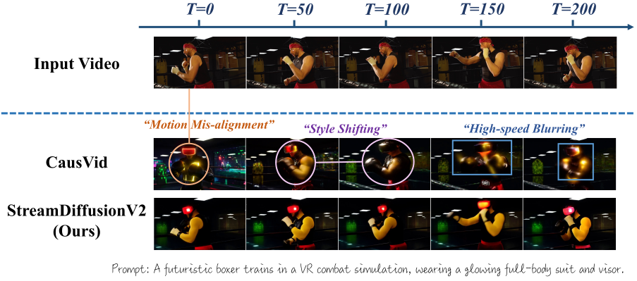

### 2. 核心技术点在做什么？

论文把系统拆成几块关键组件，核心都是围绕「**既要低延迟，又要高吞吐，还要长时间稳定画质**」展开。

#### 2.1 SLO-aware batching scheduler：既守住延迟，又吃满 GPU

- 传统做法：要么小 batch 保证实时性，但 GPU 利用率很低；要么大 batch 提升吞吐，但每一帧会排队，直播延迟变大。
- 论文提出的 **SLO 感知 batch 调度器**：
  - 以目标帧率（比如 30 FPS）和每帧 deadline 为约束，**动态调节 batch 大小和每次处理的帧数**。
  - 在分析模型是「内存带宽受限」的前提下，用 roofline 模型近似推导延迟和 batch 的关系，找到一个「既不爆延迟，又能吃满带宽」的最佳 batch。
  - 实际意义：**在多路视频流同时推理时，尽量多塞一点工作进每一步推理，但又不让任何一条流错过它的每帧时间预算**。

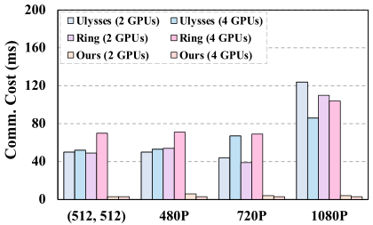

#### 2.2 Pipeline-parallel Stream-Batch：多 GPU 下接近线性加速

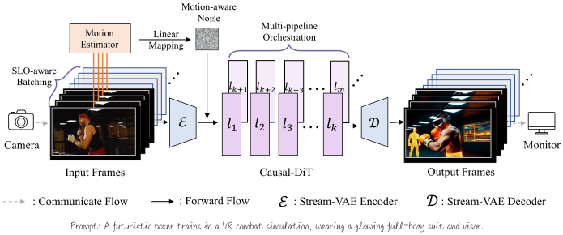

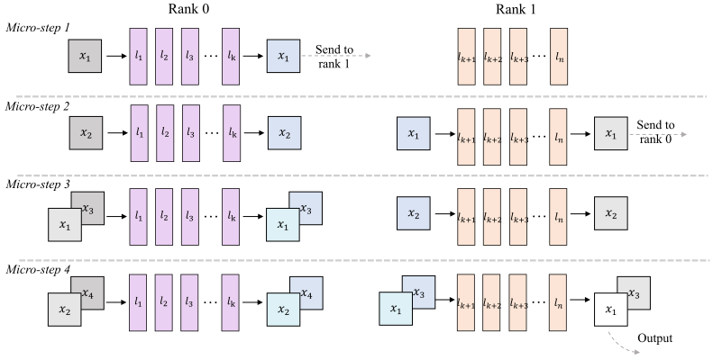

- 模型是 DiT（Transformer 风格的视频扩散模型），层数多、算力大。
- 他们把模型按层切分到多块 GPU 上，做 **流水线并行（pipeline parallelism）**，同时在每一段里做 **stream-batch 策略**：
  - 每块 GPU 只负责部分层，帧在不同 GPU 之间像「工厂流水线」一样向前流动。
  - 在流水每一段内部再做小 batch（多个流 / 多帧一起算），进一步提高利用率。
- 实验结果：在 4 块 H100 上，**14B 参数模型可以跑到 ~58 FPS，1.3B 模型 ~64 FPS**，且在增加去噪步数（追求更高画质）时，仍能保持几十 FPS 的实时水平。

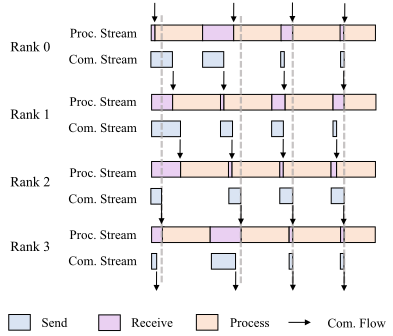

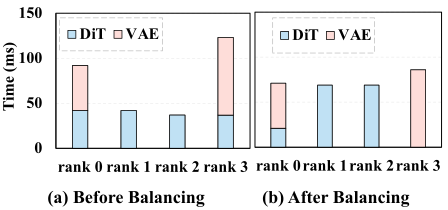

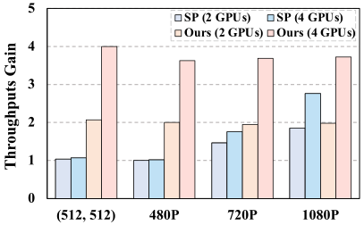

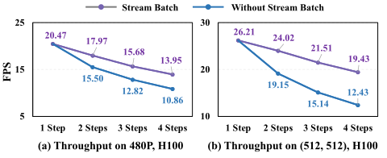

#### 2.3 Adaptive sink & RoPE refresh：让长时间直播不「越播越跑偏」

- 在长视频/长时直播里，基于 Transformer 的模型会出现：
  - 语义记忆「漂移」：后面生成的视频逐渐偏离提示词 / 初始语义。
  - RoPE 这类位置编码在非常长序列上累积偏移，导致模型对时间位置感知异常。
- 论文提出：
  - **自适应 sink token 更新**：维护一组代表当前语义的 sink token，每来一段新内容，就根据相似度更新最不相似的 sink，使其更贴合当前提示和上下文。
  - **RoPE 周期性刷新**：当时间步超过某个长度，就把 RoPE 的相位「重置」回一个窗口内，避免无限增长导致的位置漂移。
- 实际意义：**让虚拟主播或风格化直播在持续几分钟甚至更久时，仍然能和当前语境、提示保持一致，不会越播越离谱**。

#### 2.4 Motion-aware noise scheduler：根据运动强度调节噪声，稳住画面

- 不同直播内容的运动强度差异很大：有的画面几乎静止（讲解类直播），有的运动剧烈（游戏、舞蹈）。
- 固定的扩散噪声 / 去噪调度，会在：
  - 运动大时容易糊、拖影；
  - 运动小时又可能过度锐化、产生闪烁。
- 论文提出 **运动感知的噪声调度器**：
  - 用连续几帧的 latent 做差，估计运动大小。
  - 高运动时提高噪声或调整去噪轨迹，给模型更多自由度去重构运动细节；
  - 低运动时降低噪声，让画面更稳定、一致。
- 实际意义：**自动适配不同内容的运动模式，减少抖动和拖影，让观感更自然**。

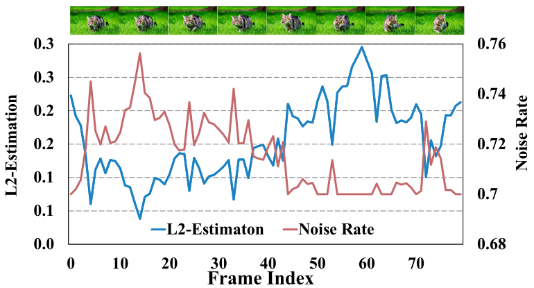

### 3. 这些技术对实际应用有什么用？

综合来看，StreamDiffusionV2 是一个「**为实时生成直播而重新设计的系统级方案**」，它的作用可以概括为几类：

1. **让「生成式直播」从 demo 走向可落地产品**  
   - 低首帧延迟（约 0.5 秒内出第一帧）、几十 FPS 的稳定帧率，让观众体验类似传统直播，而不是「卡图像放映」。
   - 在不依赖 TensorRT、量化等工程优化的前提下，只靠系统和调度就能达成高性能，为后续工程优化留足空间。

   

   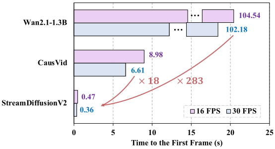

   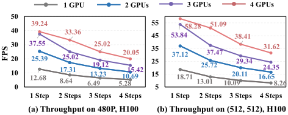

2. **支持多路直播和不同画质档位**  
   - SLO-aware 调度 + pipeline 并行，让多路流可以共享一组 GPU；不同流可以设置不同 denoising steps，实现「**超低延迟模式**」和「**高画质模式**」的切换。
   - 适合个人创作者（用少量 GPU 直播）到大型平台（多路并发、高质量输出）不同规模的场景。

3. **提升长时稳定性和观感**  
   - 自适应 sink & RoPE refresh 解决长时间 drift 问题，让虚拟主播/场景风格在 10 分钟、30 分钟甚至更长的直播中不崩。
   - 运动感知噪声调度减少鬼影、闪烁，观众看到的是连续、自然的视频，而不是一帧帧风格化图片拼接。

   

4. **保持模型无须重新训练，易于接入现有视频扩散模型**  
   - 整个方案是 training-free 的，主要在调度、缓存和并行策略上做文章。
   - 意味着：**平台可以直接拿现有 SOTA 视频扩散模型接到这个系统上，就能获得实时直播能力**，大大降低了工程集成成本。

### 示例视频与在线预览

- 官方项目页面（包含更多生成效果与 Demo 入口）：  
  https://streamdiffusionv2.github.io/

- YouTube 短视频：StreamDiffusionV2 | Real-Time Interactive Video Streaming  
  https://www.youtube.com/shorts/66hSmYeOMUY

- Reddit 社区 Demo 视频（4090 上实时交互生成，约 512×512、~9 FPS）：  
  https://www.reddit.com/r/StableDiffusion/comments/1o1a2w2/realtime_interactive_video_gen_with/

- B 站图文解读：StreamDiffusionV2：UC 伯克利联合 MIT、斯坦福提出，14B 大模  
  https://www.bilibili.com/opus/1134311827982778374

- B 站视频：试用 StreamDiffusion + TouchDesigner（基于 StreamDiffusion 一代的实时风格化示例）  
  https://www.bilibili.com/video/BV1Sb421i7rq/

- B 站视频：极速文生图！streamdiffusion 尝鲜实录（展示 StreamDiffusion 的实时生图速度）  
  https://www.bilibili.com/video/BV1LC4y1D7Ce/

### 4. 部署与算力预估（粗略）

下面是基于论文和公开实测数据的「数量级估算」，方便你感性认识大规模部署的成本（并不等同于官方 SLO 保证）。

- 公开吞吐数据（不开 TensorRT / 不量化）：  
  - 4×H100：14B 模型约 58.28 FPS，1.3B 模型约 64.52 FPS；4 步去噪时约 40 FPS 上下。  
  - Daydream/LinkedIn 报告：4×H100、4 步约 42 FPS；2×RTX 4090、1 步约 16.6 FPS。  
  - 推荐显卡：24GB 显存以上（3090 / 4090 / 5090 等）。

- 一个示例场景：480p、1.3B 模型、2 步、每路 10 FPS  
  - 粗略按 4×H100 ≈ 50 FPS 总吞吐来算。  
  - 一组 4×H100 可支撑约 `50 / 10 ≈ 5` 路实时视频流。  
  - 如果要 100 路并发，需约 `100 / 5 ≈ 20` 组，即大约 **80 张 H100**。  
  - 若每路提升到 15 FPS，需求可能上升到 ~120 张 H100；若降到 8 FPS，则约 60 张 H100 量级。

- 用 2×RTX 4090 粗估：512×512、1 步、总吞吐约 16.6 FPS  
  - 若每路要 8 FPS，一组 2×4090 只能跑约 2 路。  
  - 100 并发需约 50 组，合计 **100 张 4090**，但单卡成本比 H100 低不少，适合中小规模或原型。

- 选卡建议（按目标规模排序）：  
  - **H100 / H200 / H20 系列（80GB）**：适合 14B + 高质量多路直播的大型平台，和论文环境最接近。  
  - **A100 80GB / A800 / H800 / L40S 等数据中心卡**：性能略低于 H100，但价格更友好，适合 1.3B 多路流部署。  
  - **3090 / 4090 / 5090（24GB）**：适合几十路以内、较低分辨率 / FPS / 去噪步数的创作者工具或小规模服务。

- 可以去哪里租这些 GPU：  
  - 国际云 / GPU 云：RunPod（有 Daydream Scope 一键模板，内置 StreamDiffusionV2）、Lambda Labs、CoreWeave、Vast.ai 等。  
  - 传统大云：AWS（p4/p5/p5e 等）、GCP（A2/A3）、Azure（ND/NC 系列），适合和现有基础设施集成。  
  - 国内：阿里云、腾讯云、华为云、青云等厂商的 A100/A800/H800/H20 实例，以及算力云、gogpu 等专门 GPU 租赁平台。  

实际落地时，建议先在小规模（例如 4–8 张高端卡）上测你自己的分辨率 / 步数 / Prompt，测出真实 FPS 后，再用「总 FPS ÷ 每路 FPS」外推出所需 GPU 数量。

### 5. 一句话总结

StreamDiffusionV2 不是在发明一个新的视频生成模型，而是提出了一个 **面向实时、交互式视频生成场景的系统架构和调度策略**，让体量巨大的视频扩散模型也能在严格延迟约束下跑出高帧率、长时间稳定的直播效果，使生成式直播从「炫酷 demo」变成真正可运营的基础设施。

### 6. 竞品与相关技术（粗略梳理）

这一块主要是从论文引用和公开资料里挑出几个「同一赛道」的方案，对比一下它们和 StreamDiffusionV2 的关系。

- **StreamDiffusion（一代，图像级 Streaming 管线）**  
  - 论文：《StreamDiffusion: A Pipeline-level Solution for Real-time Interactive Generation》（Kodaira et al., 2023）。  
    - 论文页面（Hugging Face Papers）：https://huggingface.co/papers/2312.12491  
    - arXiv： https://arxiv.org/abs/2312.12491  
    - 代码仓库：https://github.com/cumulo-autumn/StreamDiffusion  
  - 核心思路：围绕 Stable Diffusion 等图像扩散模型做 **pipeline-level 优化**，包括 Stream Batch、Residual CFG、IO 队列、Tiny AutoEncoder 等，用来提升单张 / 连续图像生成的吞吐。  
  - 与 V2 的关系：  
    - V1 是「图像流式生成」，V2 则是面向「视频扩散模型」的流式系统，目标从单帧/短序列扩展到长视频。  
    - V2 延续了 Stream Batch/管线调度的思路，但在此基础上加入了 **SLO-aware 调度、pipeline 并行、sink-token–guided rolling KV cache、motion-aware noise controller** 等，更强调多 GPU、长时直播和 SLO。  
    - 可以理解为：**V2 是在 V1 的系统理念上，叠加视频模型和更强的系统工程**。

- **StreamV2V（实时 Video-to-Video 翻译）**  
  - 公开介绍中，StreamV2V 被描述为「实时 V2V 翻译的扩散模型」，通过维护一个特征库（feature library）和扩展自注意力，把历史帧特征直接融合到当前帧。  
    - 项目页（含论文链接）：https://jeff-liangf.github.io/projects/streamv2v/  
    - 代码仓库：https://github.com/Jeff-LiangF/streamv2v  
  - 核心更偏「模型结构」和「特征复用」：  
    - 利用特征库 + 扩展 self-attention + 直接特征融合，支持无限帧的视频流。  
  - 与 V2 的关系：  
    - 二者都想解决「实时 V2V + 长序列」问题，但 **StreamV2V 偏模型/表示层，StreamDiffusionV2 偏系统/调度层**。  
    - 若从产品视角看，StreamV2V 更像是一个「专用实时 V2V 模型」，而 StreamDiffusionV2 是一个「让通用视频扩散模型实时化的系统壳」。  

- **CausVid / CausVid-Plus（Causal DiT 视频扩散）**  
  - CausVid 是 MIT 等提出的因果式 DiT 视频扩散模型，用因果注意力 + 自回归结构来提升时序一致性和速度。  
    - 论文主页：https://causvid.github.io/  
    - 论文 PDF：https://causvid.github.io/causvid_paper.pdf  
    - arXiv HTML：https://arxiv.org/abs/2412.07772  
  - StreamDiffusionV2 里用到的 **14B / 1.3B Causal DiT 模型** 本身就是基于 CausVid 系列的；V2 论文也把它当作「基础模型」。  
  - 与 V2 的关系：  
    - CausVid 解决的是「视频扩散模型本身怎么设计得足够快又足够稳」，  
    - StreamDiffusionV2 则是在 **模型之上再加一层 streaming 系统**，负责调度、并行、缓存和 SLO。  
    - 从系统角度看：CausVid 是 V2 的「模型 backend」，V2 是 CausVid 在直播场景里的「部署与服务框架」。

- **Self-Forcing（带 rolling KV cache 的自回归视频扩散训练）**  
  - 论文：《Self Forcing: Bridging the Train-Test Gap in Autoregressive Video Diffusion》（Huang et al., Adobe Research）。  
    - 论文主页（Adobe Research）：https://research.adobe.com/publication/selfforcing/  
    - arXiv：https://arxiv.org/abs/2506.08009  
    - Hugging Face Papers：https://huggingface.co/papers/2506.08009  
  - 关键技术点：  
    - 在训练阶段就采用自回归 rollout + KV cache，缓解 train–test gap。  
    - 提出 **rolling KV cache 机制**，用固定窗口缓存最近若干帧的 KV，用于「无限长」视频生成。  
  - 与 V2 的关系：  
    - StreamDiffusionV2 明确写到：它的 **rolling KV cache + sink token 设计是受 Self-Forcing 启发**。  
    - 两者都用 rolling KV cache 来支持长视频 / 流式生成，但 Self-Forcing 更偏「训练范式 + 模型」，V2 把这个思路用于推理端的系统设计，并叠加了 SLO 调度、pipeline 并行等模块。  
    - 如果要找「使用了类似技术的竞品」，**Self-Forcing 是 rolling KV cache 思路的直接来源之一，需要特别标注**。

- **LongLive 等其他流式视频扩散工作**  
  - 一些近期工作（如 LongLive）也在探索「自回归视频扩散 + KV 缓存」的流式生成，在 Demuxed 等技术分享里会和 StreamDiffusion 一起被提及。  
    - LongLive 论文（arXiv）：https://arxiv.org/abs/2509.22622  
    - Hugging Face Papers：https://huggingface.co/papers/2509.22622  
  - 它们的共同点：  
    - 都尝试将视频扩散模型改造成「可流式推理」「可无限延长」的生成器；  
    - 多数会利用 **因果注意力 + KV cache + 分块生成** 这类通用套路。  
  - 与 V2 的关系：  
    - LongLive 更偏「模型设计」，StreamDiffusionV2 更偏「系统与调度」，两者在 KV 缓存、分块生成、低步数扩散等方面观念相近，但实现细节不同。  

整体来看，StreamDiffusionV2 的竞品可以 roughly 分成三类：  
1）图像级 streaming 方案（StreamDiffusion 一代）；  
2）模型级视频 streaming 方案（StreamV2V、CausVid、Self-Forcing、LongLive 等）；  
3）围绕这些模型做工程封装的平台（Daydream Scope 等）。  
V2 的独特之处在于它把「视频扩散模型 + streaming 系统 + 多 GPU 调度」绑成了一个整体 pipeline。

补充一个工程平台示例（方便实际试用）：  
- **Daydream Scope（支持 LongLive 和 StreamDiffusionV2 的实时生成平台）**  
  - 项目主页/介绍：可以从 Daydream 官方 X 账号入口进入：https://x.com/DaydreamLiveAI  
  - 代码仓库（GitHub）：https://github.com/daydreamlive/scope  
  - RunPod 云部署教程示例（视频）：https://www.youtube.com/watch?v=XBFtgSQg7X4

### 7. 专利与潜在壁垒（非常粗略的个人笔记，非法律意见）

这里只是做了一下公开信息的「常识级」梳理，不构成任何法律建议；真正要商用部署，还是需要专门做 FTO（Freedom To Operate）检索并找律师看专利文本。

- 目前能看到的公开信息：  
  - **StreamDiffusionV2 代码仓库使用 Apache-2.0 许可证**（GitHub 显示），理论上包含了作者对该仓库实现的专利授权条款。  
  - Self-Forcing、CausVid、StreamDiffusion 一代等工作，以论文和代码形式公开，但在公开搜索里暂未检索到明确标注为「对应专利号 XXX」的记录。  
  - 一些论文/聚合网站会列「相关专利」，但多为引用列表，并未仔细说明权利要求的范围。

- 可能涉及专利的技术点（风险关注点）：  
  - **rolling KV cache 用于视频扩散 / 自回归生成**：  
    - Self-Forcing 中明确提出并命名了 rolling KV cache 机制，用于长视频生成；  
    - StreamDiffusionV2 也使用 rolling KV cache（加上 sink tokens）来支持长时流式生成。  
    - 如果相关团队（如 Adobe、原作者所在机构）对这类「用于视频扩散的 rolling KV cache」提交过专利，并获得授权，那么任何独立实现类似机制的商业系统都可能需要关注。  
  - **Stream Batch / SLO-aware 调度 / pipeline 并行策略**：  
    - StreamDiffusion 一代、二代中关于 Stream Batch、SLO-aware scheduler、DiT block scheduler、pipeline 并行等设计，从工程角度看具有较强的专利化潜力；  
    - 目前公开渠道未见明确专利号，但在严肃商业化时，应视作「需要重点检索」的技术簇。  
  - **motion-aware noise scheduler 等质量控制策略**：  
    - 基于运动强度动态调节扩散噪声的想法在图像/视频生成里较自然，也有其他工作提出过类似的「自适应噪声调度」；  
    - 单就这一点来看，更像是「通用优化思路」，专利封锁可能性相对小一些，但具体实现仍取决于权利要求写法。

- 对使用者来说，比较务实的做法：  
  - 如果直接使用 **官方开源实现（StreamDiffusionV2 GitHub 仓库）**，且遵守 Apache-2.0 许可证，一般会获得作者对「该实现」的专利授权（限于他们自己拥有的专利权范围）。  
  - 风险主要来自：  
    - 你自己在此基础上做了大幅改造；  
    - 或者其他第三方（如 Self-Forcing 相关团队）对相似机制拥有独立专利，而这些权利不在 StreamDiffusionV2 的授权范围内。  
  - 如果你计划做大规模、对外收费的云服务，建议：  
    - 用论文关键词（如 *rolling KV cache for video diffusion*, *stream batch for diffusion*, *motion-aware noise scheduling* 等）在 USPTO/WIPO/CNIPA 等专利库里做系统检索；  
    - 将检索结果和你的具体实现方案交给专业知识产权律师做细读判断。

简化地说：StreamDiffusionV2 所用的大部分思想（流式调度、KV cache、少步扩散）在学术圈已经有多篇论文支撑，且主体实现以 Apache-2.0 开源，正常使用官方代码做研发风险相对可控；但如果你要把这套东西变成一个「面向大量客户的商业云服务」，还是应该专门做一轮专利风险评估。
