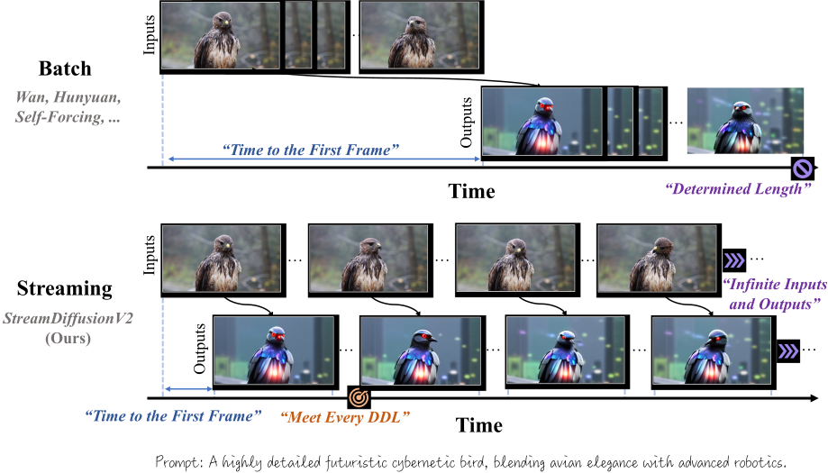
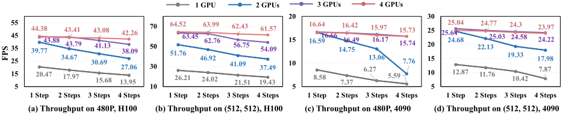
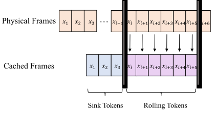
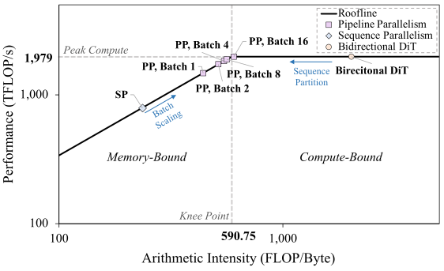

# StreamDiffusionV2 论文总结

## 这篇论文在做什么

StreamDiffusionV2 提出的是一套 **面向直播场景的视频扩散流式生成系统**，目标是把原本用于离线生成的视频扩散模型（如 Wan 2.1、CausVid）改造成可用于 **实时、长时段、交互式生成** 的在线服务。  

> “To address this, we present **StreamDiffusionV2**, a *training-free* pipeline for interactive live streaming with video diffusion models. StreamDiffusionV2 integrates an SLO-aware batching scheduler and a block scheduler, together with a sink-token–guided rolling KV cache, a motion-aware noise controller, and other system-level optimizations. Moreover, we introduce a scalable pipeline orchestration that parallelizes the diffusion process across denoising steps and network layers, achieving near-linear FPS scaling without violating latency guarantees.”  
> — StreamDiffusionV2 abstract, `paper-source/tex/paper.tex:43`

论文关注的问题是：  
- 现有视频扩散模型习惯一次性处理几十到上百帧的大块输入，虽然离线吞吐很高，但 **首帧延迟（Time-to-First-Frame, TTFF）过长**，不满足直播「秒开」需求。  
- 固定长度上下文和静态 KV cache / sink token / RoPE 配置，在长时间推理时会 **累积漂移（drift）**，导致风格逐渐崩坏、时序不一致。  
- 多 GPU 并行通常只针对离线吞吐优化，缺乏对 **实时 SLO（Service-Level Objective）** 的感知，难以在多用户、多流场景下稳定满足帧率和延迟约束。  

为此，StreamDiffusionV2 以「**训练自由（training-free）** 的系统设计」为核心，将既有高质量视频扩散模型通过一系列调度与系统优化模块，包装成一个可在单卡和多卡环境下稳定满足实时 SLO 的流式视频生成系统。

## 实现了什么效果

从论文实验结果和结论来看，主要效果包括：  
- **超低首帧延迟**：在 4×H100 上不依赖 TensorRT 或量化的情况下，首帧延迟可做到约 **0.5 秒**，显著优于直接用离线视频扩散模型。  
- **高 FPS 且可扩展**：在 4×H100 上，14B 模型达到 **58.28 FPS**，1.3B 模型达到 **64.52 FPS**；即使增加扩散步数以提升画质，仍能维持约 31.62 FPS（14B）和 61.57 FPS（1.3B），接近线性随 GPU 数量扩展。  
- **时序一致性和风格稳定性更好**：在 CLIP Score 和 Warp Error 等指标上，相比基于图像扩散的 StreamDiffusion / StreamV2V 和基线 CausVid，StreamDiffusionV2 在 **语义一致性接近甚至略优** 的前提下，显著降低 Warp Error，时序稳定性更好。  
- **长时间推理无明显崩坏**：通过滚动 KV cache 与 sink token 设计，系统可以在长时间直播中持续保持角色风格和场景一致性，避免常见的「越播越糊」「角色渐渐变样」。  
- **多场景适配能力**：通过可调扩散步数（如 1–4 步）和 SLO 感知调度，同一套系统既可以面向极端低延迟的互动场景，也可以在稍高延迟预算下争取更高画质。

> “The system scales seamlessly across heterogeneous GPU environments and supports flexible denoising steps (e.g., 1–4), enabling both ultra-low-latency and higher-quality modes. **Without TensorRT or quantization, StreamDiffusionV2 renders the first frame within 0.5s and attains 58.28 FPS with a 14B-parameter model and 64.52 FPS with a 1.3B-parameter model on four H100 GPUs. Even when increasing denoising steps to improve quality, it sustains 31.62 FPS (14B) and 61.57 FPS (1.3B)**, making state-of-the-art generative live streaming practical and accessible—from individual creators to enterprise-scale platforms.”  
> — StreamDiffusionV2 abstract, `paper-source/tex/paper.tex:43`

## 用到的关键技术与作用

论文的创新点更多集中在 **系统与调度层面**，核心模块及其用途可概括为：  

1. **SLO 感知的批处理调度（SLO-aware batching scheduler）**  
   - 将传统的 `1 × T × H × W` 大块输入改写为 `B × T' × H × W`，其中 `T'` 保持很小（只含少量帧）以控制单次推理延迟，而 `B` 表示并行处理的「流数」。  
   - 调度器根据在线测得的端到端延迟动态调整 `B`，在不违反每帧截止时间（per-frame deadline）的前提下最大化利用率。  
   - 作用：**在单卡上同时保证首帧延迟和持续帧率**，是从离线批处理转向在线服务的关键一步。  

2. **滚动 KV cache 与 sink token 机制（sink-token–guided rolling KV cache）**  
   - 针对因上下文长度无限延长导致的累积漂移问题，设计了滚动更新的 KV cache，并利用 sink token 作为「全局风格锚点」，在长时间序列中持续对风格与语义进行对齐。  
   - Ablation 结果显示：仅加入 sink token、仅加入动态噪声控制、二者同时加入，对 CLIP Score 与 Warp Error 都有不同程度提升，组合使用效果最好。  
   - 作用：**长时段稳定保持角色/场景风格和语义一致性**，减少直播过程中风格衰减或画面漂移。  

   

3. **运动感知噪声控制器（Motion-Aware Noise Controller）**  
   - 通过最近若干帧的潜空间差异估计运动强度，并在此基础上自适应调整每一块的去噪强度。  
   - 运动大时采用更保守的去噪策略，避免高频乱抖；运动小时则可以更激进地细化细节。  
   - 实验显示，该模块虽然对 CLIP Score 有极轻微的波动，但能明显降低 Warp Error，提升像素级时序对齐。  
   - 作用：**在快速运动场景下保持结构和动作连贯，同时避免细节抖动**，对高运动视频尤为重要。  

4. **可扩展的多 GPU 管线编排（Scalable pipeline orchestration）**  
   - 将 DiT 块跨设备切分，以「管线并行 + 步数并行」的方式组织推理，各设备按微步（micro-step）在环形拓扑下串接。  
   - 与仅做 sequence parallelism 或 naive pipeline parallelism 不同，该设计结合 SLO 感知批处理，对算力与通信带宽进行平衡，使系统在 Roofline 分析中运行在接近折线拐点的位置，实现接近线性的 FPS 随 GPU 数量扩展。  
   - 作用：**在多 GPU / 多用户环境下实现高吞吐且不牺牲单流延迟**，适合平台级部署。  

   

5. **DiT Block Scheduler 与 Stream-VAE 等系统优化**  
   - **DiT Block Scheduler**：推理时动态测量各设备负载，自动重新分配 DiT 块数，减小管线前后端因 VAE 编码/解码额外开销带来的负载不均，减少「气泡」。  
   - **Stream-VAE**：将长序列切成短 chunk（如 4 帧）进行编码，并缓存 3D 卷积的中间特征，以在保持时序信息的前提下降低延迟。  
   - **异步通信重叠**：每张 GPU 使用计算流与通信流两条 CUDA stream，将 P2P 传输与本地计算重叠，进一步压缩通信带来的停顿。  
   - 作用：这些优化共同保证 **多 GPU 管线在真实系统中能接近理论Roofline性能，而不是被通信或负载不均拖垮**。  

## 这些技术有什么用

从应用角度看，StreamDiffusionV2 的价值在于：  
- 对 **内容创作者和直播平台**：可以在普通直播/视频流中实时套用高质量扩散视频风格，比如换背景、加特效、驱动虚拟主播等，而且在长时间直播中保持画面稳定、不崩坏。  
- 对 **系统和基础设施开发者**：提供了一个完整的「从离线视频扩散到在线 SLO 感知服务」的设计范式，包括批处理调度、管线并行、KV cache 管理、VAE 设计和通信优化等，可为其它生成式模型（不仅是视频扩散）提供参考。  
- 对 **研究者**：论文展示了如何在不重新训练基础模型的前提下，仅通过系统与调度层面的设计，就能显著提升实时性和可服务性，为未来「模型训练 + 系统 co-design」的工作提供了有价值的经验。  

简而言之，StreamDiffusionV2 不是在发明新的视频扩散结构，而是在 **如何把已有最强视频扩散模型真正放到直播场景中用起来** 上给出了一套系统级答案，使「高质量、低延迟、长时间稳定」的生成式直播变得实际可行。

> “We propose **StreamDiffusionV2**, which closes the gap between offline video diffusion and live streaming constrained in real-time with SLO constraints. Our training-free system couples an SLO-aware batching/block scheduler with a sink-token–guided rolling KV cache, a motion-aware noise controller, and a pipeline orchestration that parallelizes across denoising steps and model layers—delivering near-linear FPS scaling without violating latency. It runs on heterogeneous GPUs and flexible step counts, **achieving 0.5 s TTFF and up to 58.28 FPS (14B) / 64.52 FPS (1.3B) on 4×H100, and maintaining high FPS even as steps increase**. These results make state-of-the-art generative live streaming practical for both individual creators and enterprise platforms.”  
> — StreamDiffusionV2 conclusion, `paper-source/tex/paper.tex:490`

## 相比 StreamDiffusion V1（图像流）有什么提升？

这里把 V1（StreamDiffusion: Pipeline-level Solution for Real-time Interactive Generation）和 V2 做一个简要对比，帮助理解「从实时图像生成」到「实时视频直播」的升级：

- **任务场景**：  
  - V1：主要面向 **图像级实时交互**（text2img / img2img），强调在 PC/单卡上的高吞吐「实时生图」。  
  - V2：直接瞄准 **实时视频直播 / Video2Video**，要求连续帧、长时段、多人/多流并发，目标是满足严格 SLO 的「直播级服务」。  

> “We introduce **StreamDiffusion, a real-time diffusion pipeline designed for streaming image generation**. Existing diffusion models are adept at creating images from text or image prompts, yet they often fall short in real-time interaction. This limitation becomes particularly evident in scenarios involving continuous input, such as augmented/virtual reality, video game graphics rendering, live video streaming, and broadcasting, where high throughput is imperative.”  
> — StreamDiffusion V1 abstract, `paper-source/v1-tex/sec/0_abstract.tex`

- **模型基础与输入形式**：  
  - V1：基于 **图像扩散模型（如 SD 系列）**，通过 Stream Batch 把传统逐步去噪改写成批处理去噪，以提升图像吞吐和时间一致性。  
  - V2：基于 **视频扩散模型（WAN 2.1, CausVid 等）**，直接处理 \(B \times T' \times H \times W\) 的视频 chunk，并针对视频长时序、快运动、RoPE/KV cache 漂移等问题做系统设计。  

- **核心优化思路**：  
  - V1：  
    - Stream Batch：把「按步顺序去噪」改成「按步打包批处理」，在不增加 U-Net 调用次数的前提下增加有效步数；  
    - Residual Classifier-Free Guidance（R-CFG）：减少负向条件的重复计算，在保持 CFG 效果的同时减半甚至更多的计算量；  
    - Stochastic Similarity Filter：在静态场景中按相似度概率性跳过推理，节省算力。  
  - V2：  
    - SLO-aware Batching Scheduler：直接把实时 SLO（TTFF、per-frame deadline）写进调度逻辑，实时调节 stream batch 大小 B，保证每一帧在 deadline 内完成；  
    - Motion-Aware Noise Controller：根据估计的运动强度动态调节噪声/步数配置，解决高速运动场景的 tearing / ghosting；  
    - Sink-token–guided Rolling KV Cache + RoPE Reset：解决长时段直播中的风格漂移和位置编码漂移，支持小时级稳定直播；  
    - 多 GPU Pipeline Orchestration + DiT Block Scheduler + Stream-VAE + 异步通信重叠：从单 GPU 方案扩展到异构多 GPU 集群，在保证延迟的前提下尽量线性放大 FPS。  

- **系统层面的发力点**：  
  - V1：更多是在 **单卡 / 小规模环境** 下做 pipeline 内部的算子级优化：一步多帧、采样加速、跳帧节能等。  
  - V2：直接站在 **云端直播服务** 视角设计，包括：多租户并发、不同算力档（从 1×4090 到 4×H100）、异构环境下的统一 SLO 调度、多 GPU pipeline 和通信重叠等。  

- **指标与效果层面的差异**：  
  - V1：主要对比的是 **图像吞吐（FPS）/ 帧时间** 和 **时间一致性**，例如在相同步数下，Stream Batch + R-CFG 相比传统逐步去噪能获得 1.5×–2× 的提速（论文 Fig. Inference Speed Comparison）。  
  - V2：  
    - 在 **首帧时间（TTFF）** 上：从传统视频 diffusion 几秒级甚至十几秒，优化到约 0.5s 级别；  
    - 在 **视频级 FPS 与扩展性** 上：4×H100 上 14B/1.3B 模型分别达到 ~58 / ~64 FPS，并且 GPU 数量增加时接近线性扩展；  
    - 在 **视频一致性（Warp Error）与语义一致性（CLIP Score）** 上：相比 V1（StreamDiffusion）和其他 baseline，CLIP Score 更高或相当、Warp Error 明显更低（参见 Tab. quality\_metrics），说明「又快又稳」。  

可以粗略理解为：  
- **V1** 解决的是「如何把一个离线图像扩散模型改造成高吞吐、可交互的实时生图 pipeline」。  
- **V2** 则是在此基础上直接迈向「实时视频 + 直播服务」：  
  - 从图像到视频、从单机到集群、从吞吐优化到 **SLO 驱动的系统设计**，并解决长时序漂移、快运动撕裂、多 GPU 调度等一系列在直播真实场景中才会暴露的问题。  

> “Specifically, Stream Batch reformulates the denoising process by eliminating the traditional wait-and-execute approach and utilizing a batching denoising approach, facilitating fluid and high-throughput streams. **This results in 1.5x higher throughput compared to the conventional sequential denoising approach. R-CFG … leading to speed improvements of up to 2.05x compared to previous classifier-free methods. … enables image generation to reach speeds of up to 91.07 fps on a single RTX 4090 GPU, outperforming the throughput of AutoPipeline, developed by Diffusers, by more than 59.56x.**”  
> — StreamDiffusion V1 abstract, `paper-source/v1-tex/sec/0_abstract.tex`

## 演示视频与项目链接（可直接看效果）

- 官方项目页（含多段对比视频、提示词说明）：  
  - https://streamdiffusionv2.github.io/  
- 官方代码仓库（README 中也有部分 Demo 说明）：  
  - https://github.com/chenfengxu714/StreamDiffusionV2  
- 社区 Demo（在 Daydream / ComfyUI 等前端中集成的实时交互视频）：  
  - Reddit 实时交互演示（4090 上跑 StreamDiffusionV2 的视频示例）：  
    - https://www.reddit.com/r/StableDiffusion/comments/1o1a2w2/realtime_interactive_video_gen_with/  
 - B 站相关内容：  
   - 我爱计算机视觉的 StreamDiffusionV2 解读（图文，含部分实验效果图）：  
     - https://www.bilibili.com/opus/1134311827982778374  
   -（可选参考，**为早期 StreamDiffusion V1，而非 V2**）一些实时生图 / 实时风格化演示视频：  
     - 极速文生图！StreamDiffusion 尝鲜实录：https://www.bilibili.com/video/BV1LC4y1D7Ce/  
     - 开源实时生图项目 StreamDiffusion，一分钟可以生成超过 XX 张图：https://www.bilibili.com/video/BV1vN4y1z75g  
     - 试用 StreamDiffusion + TouchDesigner（摄像头实时风格化实验）：https://www.bilibili.com/video/BV1Sb421i7rq/  
     - StreamDiffusion + TouchDesigner，大反差测试（4090 上 12–14 FPS 实时转绘）：https://www.bilibili.com/video/BV1Fs42137WR/  

目前在 B 站没有搜到「标明是 StreamDiffusionV2 的视频 Demo 投稿」，更多 V2 的实际对比视频可以从项目页、Reddit 或 X（推特）上的官方/协作团队账号中查看。  

建议：如果只想快速感受效果，直接打开项目页里的对比视频就可以看到「原视频 vs StreamDiffusion vs CausVid vs StreamDiffusionV2」的差异；如果关心实时性，可以特别留意 Daydream 等前端上的实时操作录像；若习惯在 B 站获取信息，可以先看上面的 V2 图文解读，再把 V1 演示视频当作对早期方案实时体验的补充参考。
